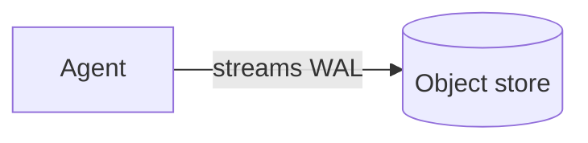

# Authoring conventions

This page documents the style choices the documentation
project commits to.  Follow these and your contribution
will fit the rest of the site without rework; deviate and
review will push back.

The high-level plan lives in
[`DOC_PLAN.md`](DOC_PLAN.md); read that first if you're
landing in this codebase for the first time.

---

## The Diátaxis split

Every doc page is **one of four types**.  Mixing them is
the most common failure mode in technical documentation,
and it's the thing reviewers will push back on hardest.

| Type | Question it answers | Voice |
| --- | --- | --- |
| **Tutorial** | "How do I learn this from zero?" | Walk-through, second person |
| **How-to** | "How do I do X right now?" | Imperative, recipe-style |
| **Reference** | "What is the exact contract / API / schema?" | Declarative, dense |
| **Explanation** | "Why does it work this way?" | Discussion, conceptual |

A page that explains *and* walks through *and* lists every
option *and* describes the design — split it.  Cross-link
between the four types liberally.

## The 3am-operator constraint

Every operational page (tutorials, how-to, runbooks) gets
read at 3am by someone tired and stressed.  Optimise for
that reader:

- **Lead with the command.**  Discussion goes after the
  command, not before it.
- **Concrete examples beat abstract syntax.**  Show
  `pg_hardstorage restore db1 --to "5 minutes ago"` before
  showing the formal grammar.
- **Recovery before discussion.**  If something can break,
  put the fix at the top.
- **Plain-English errors.**  Quote the error verbatim;
  match the suggestion to what the binary actually
  surfaces.

## Tone & voice

- **British or American English** — we don't mix.  Default
  is American, but the existing CHANGELOG and SPEC use
  British (`-ised`, `colour`).  Match the surrounding file.
  Don't refactor between the two.
- **Direct, not chatty.**  We're writing for an operator,
  not a marketer.  No "We hope this helps!"
- **Active voice.**  "The agent reconnects to the slot"
  beats "The slot is reconnected to."
- **No emojis** unless they're functional (✓ for "this
  worked", ✗ for "this didn't").  No decorative ✨.

## Page front-matter

Every page starts with YAML front-matter:

```yaml
---
title: Restore a backup at a point in time
description: One-line summary that lands in search results
              and the social preview.  Sentence case, ends
              with a period.
tags:
  - restore
  - pitr
---
```

`title` is what shows in the navigation and the page H1.
`description` is the meta + social-preview text.  Tags are
optional but help cross-cutting search.

## Section structure

For tutorials and how-to pages:

```markdown
# Page title (matches front-matter)

> One-paragraph summary that previews what the reader will
> accomplish + roughly how long it takes.

## What you need

(prerequisites)

## Steps

(numbered, one command per step where possible)

## What just happened

(a paragraph or two of "what we did, why")

## Next steps / further reading

(link to related pages, NOT the project README)
```

For reference pages: skip the prose; lead with the table /
schema / endpoint.

## Code blocks

### Languages

Always tag the language.  We use these:

- `bash` for shell commands the operator types
- `console` for terminal output we want to preserve
  formatting on (output of `pg_hardstorage status`, etc.)
- `yaml` for config snippets
- `json` for API bodies / manifest schemas
- `go` for Go interface signatures
- `sql` for psql commands

`text` is the catch-all, but reach for it last — language
tags drive syntax highlighting and code-block testing.

### Runnable code blocks

Code blocks tagged with the comment `# RUNNABLE` get
extracted by the markdown-test-runner CI gate and
executed against a containerised `pg_hardstorage` + a
fake repo.  Use this **liberally** for tutorials so they
can't bit-rot:

````markdown
```bash
# RUNNABLE
pg_hardstorage init --pg-connection postgres://… --repo file:///tmp/hsr --yes
```
````

The runner asserts:

- Exit code is 0 (or the expected exit code if the comment
  has `# RUNNABLE expect-exit=N`)
- Stdout matches a regex if `# RUNNABLE expect-match="…"` is set

Tutorials are the natural home for runnable blocks; how-to
guides should mark them too where the steps are
deterministic.

### Command + output blocks

When showing both, put them in adjacent fenced blocks:

````markdown
```bash
pg_hardstorage status db1
```

```console
db1  PG 17.2  primary @ db1.example.com:5432
  Last backup     47m ago  · full · 12.3 GB · ✓ verified
  ...
```
````

Don't merge them with `$` prompts; the operator copy-pastes
just the command.

## Cross-linking

- **Use relative paths.**  No `https://docs.…` URLs in
  prose; the site has no public domain yet and may move.
- Link prose phrases that are descriptive, not
  ["click here"](#).
- Link the term to the **most specific page** it could
  mean, not the section index.

## Diagrams

Mermaid is supported via the superfences extension:

````markdown

````

Use diagrams for:

- Architecture overviews (one per explanation page is
  plenty)
- Sequence diagrams for the WAL pipeline / restore flow
- State machines (the supervisor's lifecycle, the agent's
  reconciliation paths)

Don't use diagrams for what a table or a 3-line list would
say.

## Admonitions

```markdown
!!! note "Optional title"
    Useful supplementary info.

!!! warning
    Something the operator should pay attention to.

!!! danger
    Don't do this without understanding the consequences.
```

Reserve `danger` for irrecoverable operations
(`kms shred`, `repo gc --delete`, `backup delete --force`).

## Versioning, dates, screenshots

- **Don't put dates in prose.**  Put dates in the
  front-matter `last_reviewed:` if at all.  Hard-coded
  dates rot fastest.
- **Don't put screenshots.**  Render TUI / status output
  as `console` code blocks.  Screenshots bit-rot every
  release.
- **Prefer `pg_hardstorage <ver>` references with a
  link to changelog.**  When you must reference a
  specific behaviour change.

## Auto-generated pages

Don't edit auto-generated files in `reference/cli/`,
`reference/api/`, `reference/grpc/`, `reference/config/`,
or any page with a `<!-- AUTO-GENERATED — do not edit -->`
header.  Run `make docs-regen` to rebuild from the source
of truth.  CI fails if you commit a manual edit to one of
these.

## Submitting

- One page per PR, ideally.  Bigger PRs are fine but
  reviewers will appreciate one logical unit at a time.
- Run `make docs-build` locally before submitting; strict
  mode catches broken nav / cross-links.
- Run `make docs-doctest` locally if you added runnable
  blocks.
- The CI gates in `.github/workflows/docs.yml` will run
  the same checks — green CI means the page builds.
