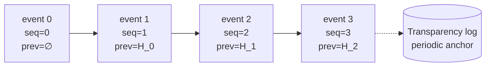

# Audit chain

Every operator-visible action in `pg_hardstorage` — a backup
committed, a hold placed, a KMS rotation initiated, an LLM
suggestion confirmed, a `repo gc` run — produces an audit event.
The events are stored as JSON files in the repository alongside
the backups themselves, but the design adds two non-obvious
properties on top:

- **Hash-chained** — each event records the SHA-256 of the
  immediately-prior event.  Tampering with any historical event
  invalidates every event after it.
- **Transparency-log anchored** (planned, post-v1.0) — the
  chain head will be periodically published to an external
  append-only log (Rekor, or a customer-managed equivalent).  Even
  an operator with full write access to the repo cannot silently
  rewrite history once an anchor has gone out.  The on-disk
  `anchors.ndjson` envelope and the export-bundle that carries it
  ship in v1.0; the periodic publish loop is engineering work
  tracked under [SPEC_DRIFT.md](../SPEC_DRIFT.md) (item #3).

This page explains the construction, the failure modes the
construction defends against, and what `audit verify-chain`
actually checks.

---

## The chain



Every event includes:

- A **monotonic sequence number** (`seq`).  Walking sequence
  numbers proves no events are missing in the middle.
- The **SHA-256 hash of the prior event's canonical JSON form**
  (`prev_hash`).  This is the chain link.
- Its own **canonical JSON form**, hashed by the next event.
- The standard event metadata: actor, deployment, RBAC scope, IP,
  KEK ref where relevant, request ID, and the typed body.

The events live at a path that makes lex-sorted listing return
them in commit order:

```text
audit/<yyyy>/<mm>/<dd>/<seq>-<id>.json
```

The per-day directory keeps the per-prefix object count bounded —
object stores hate wide listings, and a single prefix with a
million events would degrade `LIST` performance for the whole
audit subsystem.

The path above is the **global chain**. Deployment- and
tenant-scoped events live in their own *shards* under
`audit/shards/<shard>/…` — see [Sharded chains](#sharded-chains).

---

## What canonical JSON means

The hash chain only works if the canonical form is stable.  We
use a deterministic JSON encoder:

- Sorted object keys (lexicographic).
- No insignificant whitespace.
- Numbers in the smallest-precision form that round-trips.
- UTF-8 NFC normalisation for string values.

The `audit verify-chain` command re-canonicalises every event on
read and re-hashes.  A binary that produces non-canonical JSON
will fail its own verifier.

---

## What the chain defends against

The chain is engineered against four specific failure modes:

- **Silent retroactive deletion.**  Removing event 17 leaves event
  18 with a `prev_hash` that no longer matches event 16's
  canonical form.  The verifier flags it on the next run.
- **Silent retroactive rewriting.**  Changing any field in event
  17 changes its hash, which invalidates event 18's `prev_hash`,
  which cascades through the head.  Every later event has to be
  rewritten too — and the head, once anchored to the transparency
  log, is no longer rewritable without external evidence.
- **Reordering.**  The sequence number is monotonic and embedded
  in the path; out-of-order events are obvious.
- **Forking.**  Two parallel chains from the same prior hash are
  detected by the verifier (multiple `prev_hash = H_n` events in
  the same listing).  The forked chain that doesn't match the
  anchored head is the suspect.

What the chain explicitly does *not* defend against:

- An attacker who controls the binary.  A compromised agent could
  produce a clean chain of attacker-chosen events.  This is what
  cosign-signed binaries, SLSA build provenance, and reproducible
  builds are for.
- An attacker with KMS access who can re-sign manifests.  See
  [the threat model](threat-model.md).
- Loss of the audit bucket.  The chain is the in-bucket
  defence; cross-region replica + transparency-log anchoring are
  the out-of-bucket defences.

---

## Sharded chains

A single global chain per repo means **every** append — across
every deployment and tenant — reads and rewrites one head pointer
(`audit/_head.json`) and advances one global sequence.  At fleet
scale that shared head is a serialization point, and concurrent
appends to one chain can fork it.

The log is therefore partitioned into independent chains —
*shards* — keyed by the most specific scope an event carries:

| Event scope                         | Shard            | On-disk path                       |
| ----------------------------------- | ---------------- | ---------------------------------- |
| has a deployment                    | `d.<deployment>` | `audit/shards/d.<deployment>/…`    |
| has a tenant (but no deployment)    | `t.<tenant>`     | `audit/shards/t.<tenant>/…`        |
| repo-level (e.g. `gc`, `repo init`) | global (`""`)    | `audit/<yyyy>/…` (the legacy path) |

Each shard is its **own** tamper-evident chain — own head
pointer, own monotonic sequence, own `prev_hash` linkage — so
appends to different scopes never contend, and a concurrent append
to deployment A's chain can't fork deployment B's.

Sharding does **not** weaken the integrity guarantees:

- An event's scope (deployment / tenant) is part of its canonical
  JSON, so it can't be moved to another shard without breaking its
  own hash.
- `audit verify-chain` checks every shard and additionally flags
  any event filed under a shard its scope doesn't imply — a
  `misfiled` finding — which catches wholesale relocation of an
  internally-consistent sub-chain (a fork that the linkage check
  alone would miss).

The global shard keeps the exact pre-sharding layout, so a repo
written before sharding stays valid with **no migration**: its
events remain the global chain, and newly-scoped events start
landing in their own shards.

---

## Transparency-log anchoring

A hash-chain alone proves *internal consistency* but not
*non-rewriting* — an attacker who controls the entire bucket can
recompute every hash and produce a fresh chain that looks
internally consistent.  The fix is to publish the head out of
band.

The mechanism (target shape; the on-disk envelope ships in
v1.0, the periodic publish loop is engineering work tracked as
[SPEC_DRIFT item #3](../SPEC_DRIFT.md)):

1. Every N minutes (default 5) the agent computes the current head
   of **every shard** (the hash of each chain's most recent event)
   — `audit anchor` witnesses the whole sharded log, one anchor per
   shard.  Each anchor records the shard it covers.
2. Each head is published to a transparency log: Rekor by default,
   or a customer-managed log for air-gapped installs.
3. The transparency log returns a signed inclusion proof.
4. The proof is stored in the repo as `audit/anchors/<id>.json`.
5. `audit verify-chain` validates each anchor against the
   transparency log's public key and against its shard's chain at
   the anchored sequence number.

What ships in v1.0: the `anchors.ndjson` envelope inside every
audit-evidence bundle (`pg_hardstorage llm export-session` and
the bundle exporter in `internal/audit/bundle.go`).  Operators
who want anchoring today plug a transparency log of their
choice — the file format is the v1.0 wire contract.

After an anchor has gone out, **the events from sequence 0 up to
that anchor cannot be rewritten** without producing a fork that
the transparency log can't co-sign.  The chain becomes
external-witness-immutable at that point.

For air-gapped operators who cannot reach a public transparency
log, a customer-managed log under their control gives the same
property — at the cost of having to operate the log.

---

## Anchor cadence and audit-event budget

The default 5-minute cadence is a tradeoff between two costs:

- Frequent anchoring increases the audit-log volume (one
  inclusion proof per anchor).
- Sparse anchoring widens the rewrite window — events
  between two anchors are still rewritable until the next anchor.

The cadence is set per deployment via the `schedule.audit_anchor`
spec in `pg_hardstorage.yaml` (e.g. `every: 5m`).  Production
tuning typically picks between 1 min (security-sensitive, accept
higher log volume) and 15 min (capacity-constrained).

Track anchor freshness from the `audit verify-chain` output, which
reports how long it's been since the last successful anchor.

---

## What `audit verify-chain` actually does

```bash
pg_hardstorage audit verify-chain --repo <url>
```

The verifier walks **every shard** (the global chain plus each
`audit/shards/<shard>/…`) and aggregates the findings — event IDs
are globally unique, so a finding points you at the offending
event regardless of which shard it lives in.  Per shard it:

1. Lists every audit event in the time range, in path order.
2. Re-canonicalises each event and re-hashes.
3. Confirms each event's `prev_hash` equals the prior event's
   recomputed hash.
4. Confirms `seq` is strictly monotonic.
5. Confirms each event sits in the shard its scope implies — an
   event filed under the wrong shard is reported as `misfiled`
   even when its own hash is intact.
6. For each anchor in the range: validates the transparency-log
   signature, fetches the inclusion proof from the log if not
   stored locally, and confirms the shard's hash at the anchored
   sequence matches.

It then emits a structured report: total events, anchors
validated, first divergence (if any), exit code 0 on clean / 9 on
mismatch (`hash_mismatch`, `chain_break`, or `misfiled`).

Exit code 9 is the standard `verify.*_mismatch` family — it
means the system is telling you, with cryptographic specificity,
that something has been tampered with.  See [the exit codes
reference](../reference/index.md) for the rest of the family.

The verifier is read-only.  It does not heal a damaged chain;
that's an explicit operator decision.  The audit chain is
deliberately the one part of the repo that the system never
self-heals — the whole point is that any "repair" leaves a visible
trace.

---

## Audit events the LLM helper emits

The LLM safety stack uses the same audit chain — every prompt,
tool call, response, suggestion, confirmation, and execution
becomes a hash-chained audit event.  The full list is in [the LLM
safety stack](llm-safety-stack.md), but the property worth
calling out here is **chain isomorphism**: the LLM session and the
backup operations it advises on share one chain, so a
post-incident replay can show the full timeline without
correlating across separate logs.

The exportable evidence bundle (`pg_hardstorage llm
export-session`) includes a Merkle proof that the session's
events anchor at specific positions in the chain, signed with
the agent's Ed25519 keyring.  An auditor can verify the session is exactly what the
chain says it was, with no trust in the binary's good-faith
reporting.

---

## What's deferred past v1.0

The chain is real and verifiable; the audit subsystem ships
hash-chained from v0.1 onward and the durable monotonic
sequence counter shipped in v1.0.  One enhancement is still
deferred:

- **Periodic publish loop to Rekor** is post-v1.0 (tracked in
  [SPEC_DRIFT.md](../SPEC_DRIFT.md) item #3).  Until then, the
  chain is internally verifiable, the on-disk anchor envelope
  is in place from v1.0, but the periodic publish/verify
  round-trip with an external log is engineering work — an
  operator with full repo write access could still rewrite
  history if they're willing to recompute every hash.

The deferral does not change the on-disk schema; readers handle
events with or without anchor proofs transparently.

---

## Further reading

- [Envelope encryption](envelope-encryption.md) — KEK rotation
  and crypto-shred both emit audit events that anchor here.
- [LLM safety stack](llm-safety-stack.md) — every LLM session is
  hash-chained into this same log, with a signed exportable
  evidence bundle on top.
- [Threat model](threat-model.md) — what the chain is sized
  against.
- [Architecture tour: resilience design](architecture-tour.md#8-resilience-design)
  — the broader resilience posture the audit chain plugs into.
