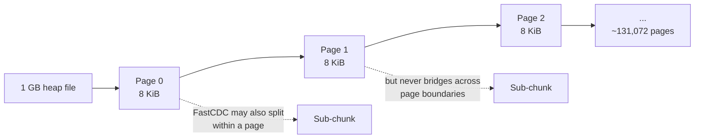

# Content-addressed storage

The repository is a content-addressed store.  Every chunk is keyed
by the SHA-256 of its **plaintext** — not its ciphertext, not its
compressed form.  Two backups that share a 4 KiB region share one
chunk on disk.  Two databases that share a tablespace share its
chunks.  A daily backup of a 1 TB database that changed 1 GB
overnight stores 1 GB of new chunks, not a 1 TB tarball.

This is the property that makes "no backup chain" work.  Every
backup's manifest references all the chunks it needs by hash;
chunks present from any prior backup are simply re-used.  Deleting
one backup cannot break another, because the chunks it needed are
still there for whichever other backups also reference them.

This page explains how the chunker decides what is a chunk, why
the keys are plaintext SHA-256 (not ciphertext), and the
properties that follow.

---

## FastCDC + page-aligned splits

PostgreSQL pages are 8 KiB.  Naive content-defined chunking that
ignores page boundaries produces a chunk distribution where small
intra-page changes cascade into adjacent chunks: change byte 12 of
page 47 and the chunker's rolling hash decides to break the chunk
3 KiB later than it did last time, which shifts every subsequent
chunk boundary, and your "1-byte change" produces a megabyte of
new chunks.

The fix is **forced splits at PG's 8 KiB page boundaries** for
heap and index files:



The chunker uses FastCDC (gear-hash, with 4 KiB / 64 KiB / 256 KiB
target/min/max parameters) for the *content-defined* dimension —
it picks split points where the rolling hash hits a target — but
it **always** splits at page boundaries regardless of what the
rolling hash says.

The consequence: a single 8 KiB page changing in a 1 GB heap
touches **exactly one chunk**, not two.  Daily backups of a busy
OLTP database achieve dedup ratios of 5-10× routinely; weekly
backups of read-heavy databases achieve 100×+.

For non-PG-aware files (config files, WAL records assembled into
16 MiB segments, the manifest itself), pure FastCDC applies — no
page-aligned forced splits, since the 8 KiB boundary doesn't mean
anything outside heap and index files.

---

## Why plaintext SHA-256 keys, not ciphertext

The chunk key is the plaintext SHA-256.  This is a deliberate
choice with three useful consequences:

- **Dedup survives compression changes.**  Switching from
  `zstd:3` to `zstd:9` doesn't break dedup — the plaintext is the
  same, the hash is the same, the chunk key is the same, the
  ciphertext (which depends on compression posture) just changes
  underneath.  The repo doesn't double-store.

- **Dedup survives cipher changes.**  Encrypting a previously
  unencrypted backup, or rotating from AES-GCM to AES-GCM-SIV,
  doesn't break dedup either.  The plaintext hash is invariant.

- **Dedup survives KEK rotation.**  Rotating the KEK changes the
  *wrapping* of the BDEK but not the BDEK itself, and not any
  derived per-chunk key.  Re-running a backup post-rotation finds
  the same chunks already in the repo.

The cost is that two writers encrypting the same chunk under
different per-chunk keys produce two different ciphertexts on
disk — but both encrypt to the same hash key, so the second
arrival sees the chunk already exists and short-circuits the
write.  Storage cost is paid once.

The third-party-attacker side of this is why the per-chunk key
derivation uses HKDF salted by both the chunk hash and a
per-tenant salt: an attacker observing the public hash space
cannot tell which two tenants share a 4 KiB chunk, because under
each tenant's salt the same plaintext encrypts to a different
ciphertext (and the per-tenant FastCDC salt described below
prevents chunk-size fingerprinting too).

---

## Per-tenant salt for fingerprint resistance

Default FastCDC parameters are public knowledge.  An attacker who
sees the chunk-size distribution in your bucket can in principle
fingerprint specific files (e.g. "this user has a backup of
`acme-pg-backup-tool.deb`").  The defence is a **per-tenant
FastCDC salt**:

```text
gear_hash_seed_t = HKDF(tenant_id, info="fastcdc-salt")
```

Different tenants get different gear-hash seeds; the same input
plaintext under tenant A and tenant B produces different chunk
boundaries and therefore different chunk hashes.  Cross-tenant
fingerprinting is broken.

The cost is **no cross-tenant dedup**.  This is by design — a
single-org install has one tenant and gets full dedup; a multi-
tenant SaaS install pays for tenant isolation with the storage
that dedup would have saved across tenants.  Within a tenant,
dedup is unchanged.

---

## On-disk chunk envelope

Each chunk is stored as:

```text
[1B version=0x02][1B compression-algo][1B encryption-algo][12B nonce][payload]
```

Self-describing.  Readers at v0.1+ handle:

- Envelope `0x01` — legacy pre-encryption (compatibility only).
- Envelope `0x02` — encryption-aware, the current default.

Compression algos: `zstd`, `none`.  Encryption algos:
`aes-256-gcm-siv` (default), `aes-256-gcm` (FIPS), `none`.

The 24-month manifest schema commitment also covers the chunk
envelope: a v0.1 reader will keep working with chunks written by
any version released within the prior 24 months.  Forward
compatibility (newer envelopes by older readers) is rejected with
a structured error pointing at the upgrade path.

---

## On-disk path layout

```text
chunks/sha256/aa/bb/aabb<rest>.chk
```

A 2/2/60 split: first two hex digits, second two hex digits, then
the remaining 60.  The split is sized so the directory fan-out at
each level caps at 256 — object stores hate wide listings, and
this layout caps the per-prefix LIST cost even at very large
scale.

SHA-256 prefix collisions at the cardinalities we ship are a
non-issue: at 100 TB and 64 KiB average chunk size, the
population is on the order of 10^9 chunks, well below the
birthday-bound for SHA-256.

The `.chk` extension is for operator hygiene only — readers
don't depend on it; they parse the envelope's version byte.

---

## Atomic writes — the resilience story

Every chunk PUT uses `O_CREATE|O_EXCL` on POSIX backends, or
`If-None-Match: *` on S3-compatible backends.  A retried upload
is a no-op: either the object already exists (success) or it
doesn't (write succeeds; if a competing writer wins the race,
ours fails harmlessly and we move on).

Manifest commits use `RenameIfNotExists` — POSIX `link(2)` +
`unlink(2)`, or S3 conditional rename.  The manifest is either
fully visible at its canonical path, or never visible.  No
partial states.

Combined: **the system has no "the upload partially succeeded"
state**.  Crashes in the middle of a chunk batch leave the repo
in a state where the next run sees some chunks present (those
will be skipped) and some absent (those will be re-uploaded).
Crashes in the middle of a manifest commit leave the manifest at
its `.tmp` path; the canonical path is unchanged; the next run
either finishes the rename or starts over.

This is the property that makes the [crash-only design]
(design-principles.md#1-resilience-above-all) actually safe.
Every "atomic" claim downstream rests on these two primitives.

---

## End-to-end checksums

Every chunk PUT carries the plaintext SHA-256 as
`x-amz-checksum-sha256` on S3 backends, or as a sidecar attribute
on filesystem backends.  The backend verifies on receive.
Mismatch retries with a fresh hash.

Every committed manifest is **re-read once** with `Get` and
compared to the canonical bytes that were written.  This catches
the rare "S3 said OK but no" cases.  One extra round-trip per
backup commit; trivial cost.

The periodic scrub job
(`pg_hardstorage repair scrub <repo>`) walks every chunk,
decrypts (if encrypted), re-hashes, and surfaces mismatches as
`verify.scrub_mismatch` (exit code 9).  Bit-rot at rest is
caught and reported.  If a replica region is configured, scrub
auto-heals from the replica.

---

## What this enables, what it costs

**Enables:**

- No backup chain — every backup is independently restorable.
- Dedup ratios that survive compression / cipher / KEK changes.
- Atomic, idempotent writes — the foundation of crash-only
  design.
- Bit-rot detection at the per-chunk level.
- Cheap cross-region replication: just copy chunks not present in
  the destination.

**Costs:**

- One SHA-256 computation per 4-256 KiB of input.  At chunker
  speed this is ~3 GB/s on a single core; not the bottleneck.
- Per-tenant salt means no cross-tenant dedup.  Multi-tenant
  SaaS pays storage for the isolation; single-org installs are
  unaffected.
- The 2/2/60 path layout produces 256² = 65,536 prefixes, which
  on some object stores can prompt initial provisioning attention
  at first-write time.  S3 auto-provisions; Azure usually does
  too.

---

## Further reading

- [Envelope encryption](envelope-encryption.md) — the
  complementary cipher layer that wraps every chunk.
- [Audit chain](audit-chain.md) — the integrity log for chunk
  writes (and everything else).
- [Architecture tour: CAS chunk store](architecture-tour.md#3-cas-chunk-store)
  — the same material from the architecture-tour vantage.
- [Threat model](threat-model.md) — what the chunk-level
  cryptography is sized against.
