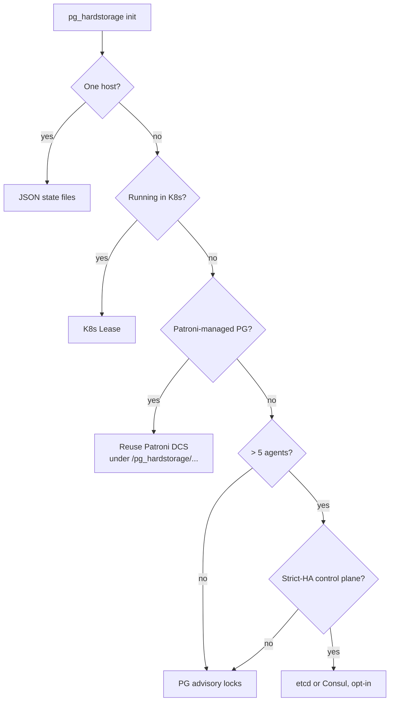

# Coordination without etcd

Most distributed-systems literature starts with "you need a
coordination service like etcd or ZooKeeper."  For backup tools
that's almost always wrong: backups don't need cluster
coordination on the hot path, they need *correctness primitives*
that scale with topology.

`pg_hardstorage` exposes three primitives — leases, key/value,
serialisation — and chooses the cheapest backend that satisfies
them at each topology.  Most installs never run a coordination
service at all.

---

## The progressive ladder

| Topology | Backend | Extra services |
| --- | --- | --- |
| One host, one PG | JSON state files under `/var/lib/pg_hardstorage/bookkeeping/` | **none** |
| One host, many PGs | Same JSON state files, per-deployment | **none** |
| 2-5 agents | **PostgreSQL advisory locks** in any reachable PG | **none new** if they already run PG |
| Kubernetes (any size) | **`coordination.k8s.io/Lease`** | **none** — uses what K8s already gives |
| Large bare-metal fleet | Advisory locks **or** etcd / Consul (opt-in) | optional |
| Multi-region active-active CP | etcd / Consul / Postgres logical replication | etcd or Consul |

Each row up the table is strictly more capable than the row
above; each row only pays for the capability it needs.

For Patroni-managed clusters, we **reuse Patroni's existing DCS**
(etcd / Consul / ZooKeeper) by writing under our own keyspace
`/pg_hardstorage/<deployment>/...`.  No second DCS, no
coordination tax.

---

## The three primitives

```go
// Lease: leader-elect a deployment's backup-runner role.
type Lease interface {
    Acquire(ctx context.Context, key string, ttl time.Duration) (handle, error)
    Renew(handle)   error
    Release(handle) error
}

// Key/value: durable small state.
type KV interface {
    Get(ctx context.Context, key string) ([]byte, error)
    CompareAndSwap(ctx context.Context, key string, old, new []byte) error
    Watch(ctx context.Context, prefix string) <-chan Event
}

// Serialisation: per-deployment "only one backup at a time".
type Serializer interface {
    WithLock(ctx context.Context, deployment string, fn func() error) error
}
```

Every backend implements all three.  The agent code calls these
interfaces; it never names a specific backend.

---

## Why no embedded SQLite

The principle is direct: **we do not ship a non-PostgreSQL
database to manage backups of a database the operator already
runs**.  An embedded SQLite would be a second database the
operator has to monitor, back up, repair when corrupted, and
upgrade.  The whole point of `pg_hardstorage` is to *reduce* the
number of moving parts in the operator's life.

For single-host installs, JSON state files under
`/var/lib/pg_hardstorage/bookkeeping/` written with atomic
`tmp+rename` are sufficient.  Crash safety is the rename's atomic
guarantee.  Concurrent access within one process is a sync.Mutex.
Concurrent access across processes is impossible — there's only
one binary on a single host.

For multi-host installs, the operator already runs PostgreSQL.
Advisory locks in a `pg_hardstorage` schema in any reachable PG
give us cross-host serialisation with no new service.  Often
that's a sidecar PG used only for coordination, sometimes the
same PG being backed up.

---

## Why advisory locks before etcd

Two reasons:

1. **It's already there.**  The operator runs PostgreSQL.  We
   don't make them stand up a second cluster service to back up
   the first one.

2. **Advisory locks are correct for our use case.**  We need
   "only one agent commits a manifest for deployment X at a
   time" — that's exactly what `pg_advisory_lock(hash(X))`
   provides.  The lock is held for seconds-to-minutes, not
   long-lived; release-on-disconnect is the desired semantic.

What advisory locks don't do well:

- Watch primitives (no `LISTEN`/`NOTIFY` plumbing for arbitrary
  prefixes — though `pg_timetable` from CYBERTEC adds nice
  declarative scheduling on top).
- Sub-second leader-election.  PG advisory locks are fine at the
  10-100 ms level but not the <1 ms level.

For very large bare-metal fleets that hit the latency tail of
advisory locks, etcd is opt-in.  K8s installs use the K8s Lease
API which sits on top of etcd already.

---

## How the wizard picks



The 90% case is one binary + one config file + one repo URL.
The wizard never asks about etcd unless the topology is "large
fleet, on-prem, strict HA".  No coordination tax for installs
that don't need coordination.

---

## What "no coordination tax" buys

Concrete consequences for operators:

- **A single-host install has zero extra services to monitor.**
  Memory budget at idle is < 100 MB, all in the `pg_hardstorage`
  process.

- **A small-fleet install adds zero new services** if PG is
  reachable somewhere.  The schema migration is one CREATE
  SCHEMA + a handful of tables; the wizard does it.

- **A K8s install adds zero new services** — K8s already runs
  the etcd that backs `coordination.k8s.io/Lease`.  We're just
  reading from it.

- **A Patroni install adds zero new services** — Patroni already
  runs etcd / Consul / ZK.  We share its DCS under our own
  keyspace.

The opt-in path (etcd / Consul for large bare-metal fleets) is
documented but not the default, and doctor will tell you if
your topology has crossed the line where it's worth considering.

---

## Further reading

- [Three execution modes](three-execution-modes.md) — how the
  modes map onto coordination backends.
- [Architecture tour: coordination layer](architecture-tour.md#5-coordination-layer)
  — the same material from the architecture-tour vantage.
- [Patroni failover deep-dive](patroni-failover-deep-dive.md) —
  how the agent reuses Patroni's DCS in detail.
