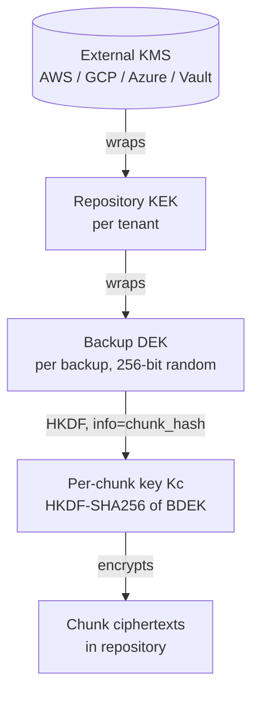
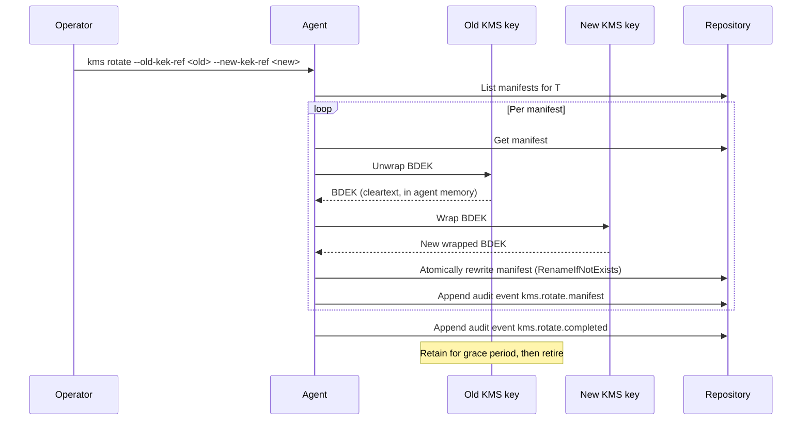

# Envelope encryption

`pg_hardstorage` keeps three classes of keys, each derived from
the one above it.  This is the standard envelope-encryption
pattern, but it pays for itself across at least three different
problems the system has to solve simultaneously: **per-tenant
crypto-shred**, **KEK rotation across millions of manifests**, and
**post-compromise containment**.

This page explains the layers, the cipher choices, and the
rotation flow.

---

## The three layers



| Layer | Lives where | Per-what | Wrapped by |
| --- | --- | --- | --- |
| **RKEK** (Repository KEK) | The configured KMS | Per tenant | The KMS itself |
| **BDEK** (Backup DEK) | `manifest.json.encryption.wrapped_dek` | Per backup | RKEK |
| **`Kc`** (per-chunk key) | Derived on demand, never stored | Per chunk | Derived from BDEK + chunk hash |

Three properties fall out of this layout:

1. **The most numerous key (`Kc`) is never stored anywhere.**  It's
   recomputed from the BDEK and the chunk hash on every
   read/write.  No "millions of keys to rotate" problem, ever.

2. **Rotating the RKEK is a manifest-rewrite, not a chunk-rewrite.**
   Decrypt the old wrapped BDEK with the old RKEK, rewrap with the
   new RKEK, atomically rewrite the manifest.  Chunks are
   untouched — and at 100 TB scale that's the whole game.

3. **Crypto-shred is a single KMS call per tenant.**  Schedule
   deletion of the tenant's RKEK in the KMS.  Backups stay
   bit-for-bit on disk but become unrecoverable.  The audit-log
   entry with attestation is the GDPR Article 17 compliance
   artifact.

---

## The cipher choices

There are two cipher modes the system actually ships:

- **AES-256-GCM-SIV** (RFC 8452) is the default.  It's
  nonce-misuse resistant — accidentally reusing a nonce reveals
  only that the same plaintext was encrypted twice, not the
  plaintexts themselves.  This matters because we derive `Kc`
  deterministically from chunk hash, and we must not assume nonce
  uniqueness across the whole chunk population.

- **AES-256-GCM** with a random 96-bit nonce is the **FIPS
  fallback**.  BoringCrypto (which is what `GOEXPERIMENT=boringcrypto`
  builds against) doesn't yet ship GCM-SIV, and we will not ship a
  FIPS build that uses an unvalidated module.  In FIPS mode the
  agent computes a fresh 96-bit nonce per chunk and stores it in
  the chunk envelope; the trade is "don't reuse nonces" replaces
  "tolerates nonce reuse".

The choice is build-time (`pg-hardstorage` vs `pg-hardstorage-fips`)
and surfaced in the manifest's `encryption.scheme` field
(`aes-256-gcm-siv` or `aes-256-gcm`).  Readers handle both
transparently.

The on-disk chunk envelope is self-describing:

```text
[1B version][1B compression-algo][1B encryption-algo][12B nonce][payload]
```

- Version `0x01` is legacy pre-encryption (compatibility only).
- Version `0x02` is the encryption-aware envelope.
- Readers at v0.1+ accept both.

The 24-month manifest schema commitment also covers the chunk
envelope: a v0.1 reader will keep working with chunks written by
any version released within the prior 24 months.

---

## Why per-chunk keys?

A naive design would encrypt every chunk with the BDEK directly.
We don't, for three reasons:

- **Compromise of one chunk's nonce/ciphertext doesn't help the
  attacker** with any other chunk, because each chunk has its own
  derived key.
- **`Kc` is bound to the chunk hash**, so swapping a chunk's
  ciphertext for a different (but valid) ciphertext fails
  authentication — we'd be decrypting with the wrong key.
- **The HKDF derivation is cheap** (single SHA-256-HMAC) and
  trivially parallel.  At chunker speed it costs less than the
  compression step.

The HKDF info string is the chunk's plaintext SHA-256.  The salt
is the manifest's `system_identifier` plus tenant ID, which is
why the same chunk plaintext encrypted under two different
tenants produces two different ciphertexts (no cross-tenant
fingerprinting via repeated chunk identity).

---

## Per-tenant KEK is mandatory architecture

Single-org installs get a default tenant they never see — but the
tenant boundary exists in the data layout regardless.  This is a
design choice, not a tier:

- **GDPR crypto-shred** is `pg_hardstorage kms shred --confirm-keyring <keyring-dir>
  --reason "GDPR Art. 17 request #4421"`.  One key-destruction op.  The
  audit event is the compliance artifact.
- **Multi-tenant SaaS** can isolate customer A from customer B
  cryptographically: even if every chunk leaks, only the owner's
  KEK can decrypt their tenant's BDEKs.
- **Data-residency pinning** is enforceable per-tenant by storing
  each tenant's RKEK in a region-pinned KMS.  Violating the policy
  requires both bypassing the storage backend's region constraint
  *and* the KMS's region constraint — two independent breaches.

The cost is one extra KMS call per backup commit (wrap the BDEK)
and one per restore (unwrap).  The KMS cache on the agent makes
this effectively free for steady-state workloads.

---

## KEK rotation flow

`pg_hardstorage kms rotate --repo <url> --old-kek-ref <old> --new-kek-ref <new>` walks
every manifest in the repo wrapped under the old KEK ref:



A few properties worth highlighting:

- **Chunks are not re-encrypted.**  The BDEK is unchanged; only
  its wrapping changed.  At 100 TB this is the difference between
  a one-hour rotation and a one-month rotation.
- **The cleartext BDEK lives in agent memory only.**  It never
  touches disk after the original generate-and-wrap step at backup
  time.  Memory pages holding BDEKs are mlocked where the OS
  supports it.
- **Rotation is resumable.**  Each manifest's rewrite is atomic;
  the audit log records progress; a crash mid-rotation resumes by
  listing manifests still wrapped under the old KEK.
- **The old KEK retires after a configurable grace period** (so
  in-flight reads against the old wrapping have time to drain).
  After retirement the old KEK can be scheduled for deletion via
  the KMS's own retention policy.

`pg_hardstorage repair attestation <backup-id>` exists for the
adjacent case — re-signing a manifest whose Ed25519 signature no
longer validates after a rotation that also rotated the
attestation key.  See the architecture tour for the full repair
toolkit.

---

## What this defends against, what it doesn't

**Defends against:**

- A repository operator with full read access to the bucket but
  no KMS access.  They see ciphertext only.
- Loss of a single tenant's KEK in the KMS — only that tenant is
  unrecoverable.  Other tenants are unaffected.
- Backup-tape theft, cloud-storage misconfiguration that exposes
  the bucket — the chunks are individually encrypted with keys
  the attacker doesn't have.
- Need to honour a GDPR erasure request without rewriting every
  backup.

**Does not defend against:**

- An attacker with both KMS access and bucket access.  At that
  point you have an authorised principal, and the audit log is
  what catches misuse.
- An attacker who compromises the agent process at runtime — they
  see the cleartext BDEK in memory while a backup is in flight.
  This is what mlock'd buffers, panic-capture, and the crash-only
  design are about: keep the window short and the evidence
  visible.
- Quantum cryptanalysis.  AES-256 is widely believed to retain
  ~128 bits of post-quantum security; we will revisit if NIST PQC
  standardisation says otherwise.

The full threat model for the system as a whole is in
[threat-model.md](threat-model.md).

---

## Further reading

- [TDE awareness](tde-awareness.md) — orthogonal layer for source
  PG with Transparent Data Encryption (CYBERTEC PGEE, pg_tde,
  EDB TDE).  Envelope encryption protects bytes-at-rest in the
  REPO; TDE protects bytes-at-rest on the SOURCE PG's disks.  They
  stack cleanly for defence in depth (a backup can have both
  layers active simultaneously).
- [Audit chain](audit-chain.md) — every encryption-related event
  (wrap, unwrap, rotate, shred) is hash-chained.
- [Architecture tour: encryption + compliance](architecture-tour.md#3-cas-chunk-store)
  — where chunk envelopes live in the larger architecture.
- [Threat model](threat-model.md) — the attacker capabilities the
  envelope is sized against.
- [Compliance index](../compliance/index.md) — control-mapping
  pages that cite this design.
