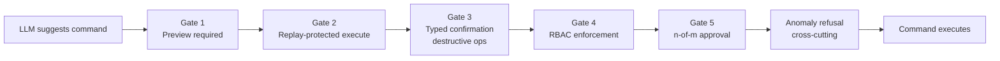
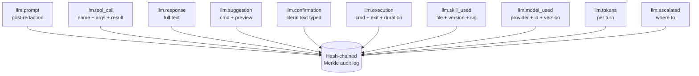

# LLM safety stack

The LLM helper (`pg_hardstorage llm`) is one of the highest-leverage
features in the binary — and one of the highest-risk ones if it's
shipped naively.  An LLM that can read your cluster state and
"helpfully" suggest a `kms shred` command at 3 AM, executed by a
tired operator who pressed `y` without reading, is worse than no
LLM at all.

This page explains how the binary makes that scenario impossible
by construction, and what the evidence trail looks like
afterwards if something does go wrong.

The short version: there are **five gates** between the LLM's
suggestion and an executed command, and **everything that crosses
each gate is hash-chained into the audit log**.  The LLM is a
tool; the human operator is the actor; the binary is the
executor; all three actions are independently witnessed.

---

## The five gates



### Gate 1 — Preview required

Every suggestion goes through `preview_command` before it can be
proposed to the user.  Preview produces the same JSON output the
operator sees from `--preview` on the CLI: what changes, what RTO
is expected, blast radius, pre-flight check status.

If preview fails — the command is invalid, the deployment doesn't
exist, the target is unreachable — the suggestion is silently
retried at most twice.  On third failure the LLM tells the user
it cannot find a valid command and proposes asking a human.

**The user never sees a suggestion that hasn't been validated by
the same code path that runs the command.**  The LLM cannot
hallucinate a command into existence.

### Gate 2 — Replay-protected execute

`execute_command` validates that the *exact* string was just
shown by `preview_command` in this same turn.  The match is a
sliding-window comparison with a short freshness window — stale
or absent previews cause execute to refuse.

Three properties this enforces:

- The LLM cannot construct a command string that bypasses
  preview.
- The LLM cannot show one preview to the user and execute a
  different command.
- The execute path is *not* a separate code path — it's the same
  code that runs from the CLI.  No parallel implementation, no
  second source of truth.

This is what defends against the "the LLM lied to me" failure
mode: the executed command is byte-equal to the one the user saw.

### Gate 3 — Typed confirmation for destructive operations

For the most dangerous operations — `kms shred`, `repo gc
--delete`, `backup delete --force`, `repo wipe` — confirmation is
**typed**, not pressed.  The user must type the literal command
string back to the binary.  The LLM cannot type for them.

The list of typed-confirmation operations is in code, not
configurable downward:

- `kms shred` — irreversible loss of a tenant's KEK.
- `repo gc --delete` — actually frees disk space (vs the dry-run
  default).
- `backup delete --force` — bypasses retention.
- `repo wipe` — full repository destruction.

This is the gate that catches "tired operator presses `y`
reflexively" — typing seven characters is the smallest deliberate
act we can demand.

### Gate 4 — RBAC enforcement

The LLM never bypasses RBAC.  It runs as a real principal with a
real token.  Tokens are JIT-issued, time-boxed, and scoped to the
operator's permissions — **the LLM cannot ask for more than the
human could do directly**.

If the operator's RBAC scope doesn't include `kms:rotate`, the
LLM's suggestion of `kms rotate ...` fails at the token-check
step, not at the user-confirmation step.  The structured error
includes the missing verb.

### Gate 5 — n-of-m approval

For operations configured with n-of-m approval — typically the
same destructive set as Gate 3 — the binary will not execute
until the configured number of approvals have arrived.  The LLM
can invite a second approver via the configured Sinks: drop a
Slack message, open a Jira ticket, raise a PagerDuty page.
Approval comes through the standard binary-side flow; the LLM
cannot fake it.

n-of-m thresholds are configurable per operation:

```yaml
approvals:
  kms_shred: { initiator: 1, approvers: 2 }
  repo_gc_delete: { initiator: 1, approvers: 1 }
  backup_delete_force: { initiator: 1, approvers: 1 }
```

### Anomaly refusal (cross-cutting)

If the LLM proposes a command that is wildly inconsistent with the
just-prior context — user asked about restoring a backup, LLM
proposes `kms shred` — the safety layer refuses with a structured
event.  Audited.  The skill is sandboxed off until the operator
reviews.

The detector is a small classifier over recent context: backups,
restores, and verifications are one cluster of operations;
destructions are another; jumping between clusters without an
intervening user statement is treated as evidence of a prompt
injection or a hallucinated escalation.

This is the "the LLM was malicious / compromised" failure mode.
It's the gate that catches *the model itself* going wrong, not
just the model being misused.

### Response correctness (the command-validator)

The gates above stop *dangerous* advice. A separate layer stops
*wrong* advice — the everyday way a smaller model fails an
operator: a command that won't run, or a destructive command
described as harmless. Every `pg_hardstorage ...` command the
model emits is extracted from its reply (only from fenced code
blocks and inline backtick spans — never from prose) and checked
against the live cobra command tree:

- **Unknown verbs / flags** — `deployment create` (the real verb
  is `add`), or a misspelled `--connection`, are rejected with a
  did-you-mean.
- **Missing required flags** — a `backup db1` without
  `--pg-connection`, or a `rotate db1 --apply` without `--repo`,
  is flagged. (Required-ness is read both from cobra's
  `MarkFlagRequired` annotation and from a `(required)` marker in
  the flag's help text, so commands that enforce their flags
  manually are still covered.)
- **Positional arguments are understood** — `backup db1` is a
  valid positional, not an "unknown subcommand", even though
  `backup` also hosts `backup delete`.
- **Destructive-vs-described mismatch** — a command carrying
  `--apply` / `--force` / `--yes`, or a `shred` / `wipe` verb,
  that the surrounding text labels a "dry-run", "preview", or
  "safe" is flagged: *"DESTRUCTIVE — running it WILL
  execute/delete; a real dry-run omits `--apply`."* The dry-run
  of any command is the same command **without** `--apply`.

Findings attach to the reply as command-validator warnings and,
within a bounded retry budget, are fed back to the model so it can
self-correct before the operator ever sees the bad command. The
always-injected **Command correctness** hard rules push the model
the same way up front: include required flags, never mislabel a
destructive command, never invent file paths (the real signing
keys are `manifest_signing.ed25519` / `manifest_signing.pub`), and
prefer the tool's own structured-error remediation over
improvising.

### Bounded context (the model can't be drowned)

The helper pre-loads live cluster state (`doctor`, `status`,
deployment list) into the system prompt so the model starts
grounded. Those outputs are **capped per tool** (and so are tool
results fetched mid-conversation): on a large or broken repo an
uncapped `doctor` body once pushed the incident-skill prompt past
the model's context window and the whole request was rejected —
the assistant failed exactly when an operator needed it. Each body
is now truncated to a fixed budget with a note telling the model
to call the tool directly for the full result, so the prompt stays
bounded regardless of repo size.

---

## What gets logged at every step



Everything in the diagram appends to the same hash-chained
Merkle log that everything else in the system uses (see [the
audit chain](audit-chain.md)).  Sinks fan out where configured.
WORM and transparency-log anchoring apply.

The implication: **a post-incident review can replay the entire
3 AM session**, including what the model saw, what it suggested,
what the operator typed, and what the binary did — with
cryptographic evidence that none of it was rewritten afterwards.

---

## The signed evidence bundle

Any session can be exported as a signed bundle:

```console
$ pg_hardstorage llm export-session <session-id>
Wrote signed evidence bundle to ./session-20260428T1423-db1-restore.evidence.tar.gz
  - transcript.ndjson         (every prompt, tool call, response, in order)
  - tool_results/             (raw JSON of each tool call's return)
  - executed_commands.ndjson  (every command actually run, exit code, duration)
  - audit_chain_proof.json    (Merkle proof: this session's events anchor at chain pos 1428..1547)
  - skill_used.yaml           (the exact skill file at the version used)
  - skill_signature.sig       (Ed25519 signature, agent keyring)
  - model_metadata.json       (provider, model id, model version, model fingerprint)
  - signature.sig             (Ed25519 signature on the bundle)
```

The bundle is what an admin shows in a post-incident review or a
regulatory audit.  Independent verifiability — no trust required
in our software's good-faith reporting.

The Merkle proof in `audit_chain_proof.json` ties the session's
events to specific positions in the global audit chain.  An
auditor can re-verify the chain (`audit verify-chain --repo
<url>`), confirm the session's events are in the chain, and confirm
the chain's anchor matches the transparency log.  Three
independent layers of evidence.

---

## Skills are YAML files, not Go code

The builtin skills (`ask`, `explain`, `incident`, `restore`) are
versioned, declarative YAML files — not Go functions baked into
the binary.  Implications:

- **Hot-fix loop in minutes, not weeks.**  A bad skill response in
  production gets a same-day patch — author a new YAML file,
  increment the version, and `pg_hardstorage llm skill install
  <file>` into the operator overlay (any existing version is
  snapshotted for rollback).  No binary rebuild, no Debian package
  release.
- **Skill isolation.**  A bug in the incident skill cannot
  touch the restore skill.  Each skill loads independently, has
  its own tool allowlist, its own guardrails, its own RBAC scope.
- **Inspectable, with signing on the roadmap.**  Skills load as
  plain, reviewable YAML today.  Cryptographic skill signing and
  signature verification (a project key for shipped skills, the
  operator's key for local ones) are planned, not yet shipped.
- **Linted.**  `pg_hardstorage llm skill lint <file>` validates
  the schema and static-checks the tool list (no banned tools, no
  missing required ones).

A skill file declares which tools are available to the LLM in
that session.  The `restore` skill explicitly excludes
`execute_command`, `kms_*`, `repo_gc`, `backup_delete` — meaning
even if the LLM goes off the rails inside the restore wizard, it
**cannot suggest** a destructive op, let alone execute one.

---

## Privacy modes

Four data-flow modes, default-conservative:

| Mode | What crosses the LLM-provider boundary |
| --- | --- |
| `strict` | Error codes, metric names, runbook IDs.  No deployment names, no LSNs, no error messages. |
| `standard` (default) | Metadata, doctor JSON, error messages, redacted config.  PII detector strips obvious patterns. |
| `open` | Everything (with credentials always masked).  Dev / staging only. |
| `local-only` | Refuses any provider that isn't local (Ollama, llama-cpp).  Auto-selected for `data_classification: confidential` or higher. |

The mode is per-deployment, not per-call.  An operator who runs
`llm` against a deployment classified `confidential` cannot
accidentally route its data to OpenAI — the binary refuses to
load any non-local provider for that session.

---

## What this defends against

The five-gate stack plus the evidence trail defends against a
specific set of failure modes:

- **"The LLM told me to."**  The audit shows it didn't *tell* you
  — it *suggested*, you *confirmed*, the system *executed*.
  Three independent decisions, each cryptographically witnessed.
- **"The LLM lied about cluster state."**  Every factual claim is
  footnoted with the tool call that backed it; the bundle has the
  raw tool-call results to compare against.
- **"You released a bad model update."**  The bundle records the
  exact model id and version.  Provider-side model versioning is
  captured.
- **"The skill was malicious."**  Skills load as reviewable YAML
  and are schema-linted before install; the exact skill name and
  version are recorded in the audit bundle.  (Cryptographic skill
  signing is roadmap, not yet shipped.)
- **"You hid prompts from me."**  `/show-context` plus the export
  bundle prove otherwise.
- **"A prompt injection in a manifest description executed
  `kms shred`."**  Anomaly refusal and the typed-confirmation
  gate both fire; the chain shows the injection attempt.

---

## Release timeline

v0.5 shipped the read-only LLM helper with the tool surface
restricted to `read_*`, `search_*`, `preview_command`,
`suggest_command` — no mutation possible.

**v1.0 ships `advise+execute` mode with all five gates active.**
The LLM can now propose a mutating command; preview validates,
typed confirmation runs against the operator, RBAC checks the
caller's principal, n-of-m collects approvals where configured,
and anomaly refusal fires on out-of-pattern proposals.  Read-only
mode is still the default; `advise+execute` is opt-in per
session.  Audit infrastructure was in place from v0.5 onward, so
the v1.0 unlock is a feature flip, not a redesign.

---

## Further reading

- [Audit chain](audit-chain.md) — the underlying tamper-evidence
  layer every gate writes to.
- [Architecture tour: output architecture](architecture-tour.md#7-output-architecture)
  — the typed-event bus the LLM tools and Sinks share.
- [Threat model](threat-model.md) — the attacker capabilities the
  five-gate design is sized against.
