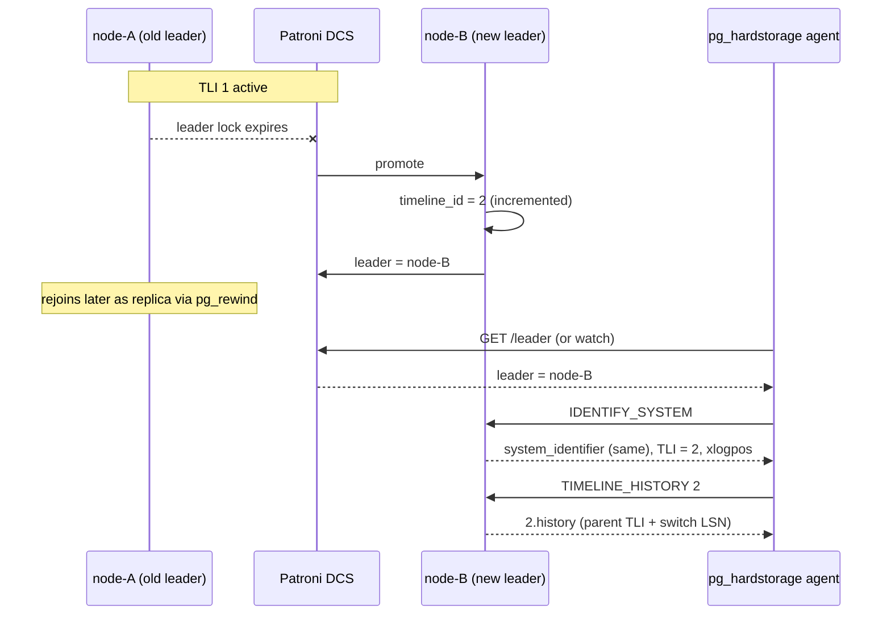

# Patroni failover deep-dive

Patroni-managed PostgreSQL clusters are common production
topologies, and they have one architectural property that
backup-streaming tools have to reckon with explicitly: **physical
replication slots are not synchronised across nodes by default.**
A slot you created on `node-A` does not exist on `node-B`.  When
Patroni promotes `node-B`, your stream breaks and a naive
reconnection silently introduces a WAL gap.

`pg_hardstorage` makes streaming work across failovers via four
cooperating mechanisms.  Three of them are about *avoiding* gaps;
the fourth is about being *honest* when one happens anyway.

---

## What actually happens in a Patroni failover

For grounding, here is what the cluster does:



For the agent specifically, this raises four concrete problems:

- **The slot doesn't exist on `node-B`.**  PG does not replicate
  physical slots across nodes.  `START_REPLICATION SLOT
  pg_hardstorage_db1 PHYSICAL ...` against the new leader returns
  an error.

- **The timeline changed.**  All WAL `node-B` writes from now is
  on TLI 2.  Continuing to write WAL under the old timeline
  directory in the repo would silently bury the divergence and
  break PITR.

- **There may be a small WAL gap.**  Async-replicated WAL that
  `node-A` committed but `node-B` had not received before promotion
  is gone.  This is an inherent property of any async-replication
  setup — not specific to backup tools.

- **The repo must remain restorable.**  The history file for the
  new timeline must be captured, or PITR across the failover
  boundary won't work.

The four mechanisms below address these in order.

---

## Mechanism 1 — leader-following with Patroni REST awareness

The agent does **not** connect to a hard-coded hostname.  It
polls Patroni's REST API (`GET /cluster`, `GET /leader`) and
watches for leader changes via long-poll or the underlying DCS
watch (etcd `Watch`, Consul `blocking query`, ZooKeeper watch).
On a leader change event:

1. Stop the active replication connection cleanly (don't drop the
   slot).
2. Capture the last confirmed flush LSN from the agent's local
   state, which is mirrored periodically into the repo.
3. Reconnect to the new leader address.
4. Run `IDENTIFY_SYSTEM` — fetch `system_identifier`, the new
   `timeline_id`, the current `xlogpos`.  **Confirm
   `system_identifier` matches** — otherwise this is a different
   cluster (someone repointed Patroni at a fresh init), hard
   refuse.
5. Run `TIMELINE_HISTORY <new_tli>` and store the `.history` file
   in the repo at `wal/<deployment>/timelines/<new_tli>.history`.
   The history file describes where the new timeline branched off
   from the previous one.
6. Reopen the slot on the new leader (see Mechanism 2) and resume.

The history-file capture is the load-bearing step — without it,
PITR across the failover boundary fails because PG's recovery
can't find the parent timeline.  The agent fetches the file on
every connection, so it's always in the repo.

---

## Mechanism 2 — slot continuity (three strategies, ranked)

The agent picks the best available strategy based on the cluster's
PG version and Patroni version.  `doctor` reports which strategy
is active.

### Strategy A — Patroni `permanent_slots` (recommended)

Works on PG 15/16/17 with Patroni 3.0+.  At `pg_hardstorage init`
against a Patroni-managed cluster, the wizard offers to add the
slot to Patroni's configuration:

```yaml
# patroni.yml additions for the pg_hardstorage replication slot
slots:
  pg_hardstorage_db1:
    type: physical

permanent_slots:
  pg_hardstorage_db1:
    type: physical
```

Patroni then creates `pg_hardstorage_db1` on every node and
**recreates it on the new leader on failover**.  The slot's
`restart_lsn` is propagated by Patroni's slot-advance logic on
every cycle, so the new leader's slot resumes very close to where
the old one was.  Residual gap (if any) is at most one Patroni
cycle of WAL — typically less than 100 MB.

If the agent doesn't have permission to edit Patroni's config,
the wizard prints the YAML and tells the operator to add it.
`doctor` rechecks every cycle and clears the warning when the
configuration is present.

### Strategy B — PG 17+ synced slots

PG 17 introduced slot synchronisation for logical slots and
broader infrastructure for physical slot failover.  Where the
cluster is on PG 17+, the agent uses this path natively — no
Patroni config edit required.  The mechanism is built into PG
itself, so failover semantics match the upstream definition.

### Strategy C — recreate on detection (the v0.1 fallback)

For PG 15/16 clusters without Patroni-managed slots, on reconnect
the agent runs `IDENTIFY_SYSTEM`.  If our slot doesn't exist:

1. `CREATE_REPLICATION_SLOT pg_hardstorage_db1 PHYSICAL RESERVE_WAL`
   on the new leader.
2. Compute `gap = new_slot.restart_lsn - last_confirmed_lsn`.
3. If `gap == 0`: clean continuation, log info.
4. If `gap > 0`: WAL gap detected.  Agent emits `wal_gap_detected`
   event with severity, `doctor` reports it, the configured Sinks
   fan out alerts.  The repo's WAL inventory has a hole between
   `last_confirmed_lsn` and `new_slot.restart_lsn`.  PITR is
   **possible only outside that range**; the manifest of any new
   backup taken after this point notes the gap so restores within
   the window are explicitly refused with a clear error.

Strategy C is honest about loss.  It never silently glosses over a
gap.  The user is told to upgrade to Patroni `permanent_slots` (or
the agent does it for them with `--patroni-edit`).

---

## Mechanism 3 — dual-slot mode

For tier-0 deployments — usually 50 TB+ or `availability=high` —
the dual-slot mode eliminates this entire class of problem:

```yaml
deployments:
  db1:
    patroni:
      slots:
        - { name: pg_hardstorage_db1_primary, role: leader }
        - { name: pg_hardstorage_db1_replica, role: replica }
```

Both slots stream concurrently into the same content-addressed
store.  CAS dedup means duplicate chunks cost nothing.  When the
primary fails over to `replica1`, **the replica's slot is already
on the new primary** — the agent simply continues streaming
through it.  The old primary's slot is recreated by Patroni
`permanent_slots`, and the agent re-establishes the dual
configuration on the next reconciliation.

For the simple single-slot case under typical Patroni cycle rates,
the residual gap is sub-second and we accept it.  For dual-slot,
the gap is typically zero.

---

## Mechanism 4 — synchronous-target mode (not implemented)

Synchronous-target mode is a design aspiration, not a shipped
feature.  The intended posture: an opt-in `wal_mode: synchronous`
would make the agent advertise itself as a candidate in
`synchronous_standby_names`, so PG **would not commit a
transaction until our agent had fsynced the WAL into the repo**.
On failover, no committed transaction could be missing, because
none committed without our ACK — RPO = 0 across the failover
boundary.

What ships today is *detection only*: preflight checks report
where `sync_standby` slots are placed and flag configurations that
would strand WAL, but there is no `wal_mode: synchronous` config
key and the agent does not itself join
`synchronous_standby_names`.  The always-on ACK path is roadmap.

---

## Timeline storage in the repo

Timelines are first-class citizens in the repo layout:

```
wal/<deployment>/
  timelines/
    1.history          # captured the first time we see TLI 1 (usually empty)
    2.history          # captured on first promotion: parent TLI + switch LSN
    3.history          # captured on subsequent failover
    ...
  1/<prefix>/...wal    # WAL files per timeline
  2/<prefix>/...wal
  3/<prefix>/...wal
```

Every manifest carries the timeline it ended on:

```json
{ "timeline": 2, "stop_lsn": "0/30001A0", "wal_required": ["..."] }
```

Restore (PITR) walks the timeline history to reconstruct the
chain:

```
target LSN on TLI 3
  → switch point on TLI 3
  → resume on TLI 2
  → switch point on TLI 2
  → resume on TLI 1
  → base backup on TLI 1
```

PG's recovery understands timeline history natively.  We just
need to ensure all `.history` files are in the repo at restore
time, which the agent fetches on every connection — so they're
always there.

---

## What `doctor` reports

```console
$ pg_hardstorage doctor db1
  db1 — PG 17.2 — Patroni 3.3.1 — leader: node-2 (since 2026-04-28 09:12)
    ✓ Patroni REST reachable (3 nodes, all healthy)
    ✓ Slot continuity strategy: A (Patroni permanent_slots)
    ✓ Slot 'pg_hardstorage_db1' present on all 3 nodes
    ✓ WAL streaming active from leader node-2, lag 8s
    ✓ Last 3 timelines captured: TLI 1, 2 (switched at 0/15A2B388), 3 (switched at 0/2400FF80)
    ✓ Last failover: 47h ago, gap during failover: 0 bytes (dual-slot)
    ✓ Backup posture: tier-1 (sync-target NOT enabled, RPO target met by streaming + dual-slot)
```

Each line maps to a specific mechanism:

- "Slot continuity strategy" → Mechanism 2 (which of A/B/C is
  active).
- "Slot present on all N nodes" → Strategy A health check.
- "Last failover: gap during failover" → the auditor's history.
- "Backup posture" → which combination of mechanisms is engaged
  for this deployment.

---

## Failover-mode interactions and the explicit refusals

A few combinations the design refuses by construction:

- **`pg_rewind` removes WAL from the rewound node.**  We never
  back up from a non-leader; Patroni REST is the source of truth
  for *who is leader right now*.
- **Split-brain (two nodes claim leader)** — agent refuses to back
  up either node and emits a critical alert.  The DCS-backed lease
  guarantees only one agent commits a manifest; both connections
  may be open but at most one progresses past `pg_backup_stop`.
  See [R7 — Patroni split-brain]
  (../reference/runbooks/R7-patroni-split-brain.md).
- **Bootstrap of a brand-new replica** via Patroni's
  `bootstrap.method: pg_hardstorage` runs the restore against the
  *repo*, not against the live cluster, so it's failover-immune by
  construction.

---

## Release-by-release implementation

**v0.1:**

- Leader-follow via Patroni REST (Mechanism 1).
- Strategy C slot recreation with explicit gap detection
  (Mechanism 2).
- Full timeline-history capture and storage.

**v1.0:**

- Strategy A — Patroni `permanent_slots` integration.
- Strategy B — PG 17+ synced slots.
- Dual-slot mode (≥ 50 TB, via a `patroni.slots:` list).

**Roadmap:**

- Sync-target mode (`wal_mode: synchronous`) — detection of
  `sync_standby` placement ships today; the always-on ACK path is
  not yet implemented.

---

## Further reading

- [WAL pipeline](wal-pipeline.md) — the streaming substrate this
  page builds on.
- [R6 — Slot dropped, gap detected]
  (../reference/runbooks/R6-slot-dropped-gap.md) — the operator
  runbook for the case Strategy C surfaces.
- [R7 — Patroni split-brain]
  (../reference/runbooks/R7-patroni-split-brain.md) — the harder
  failure mode.
- [Architecture tour: Patroni failover handling](architecture-tour.md#9-patroni-failover-handling)
  — the same material from the architecture-tour vantage.
