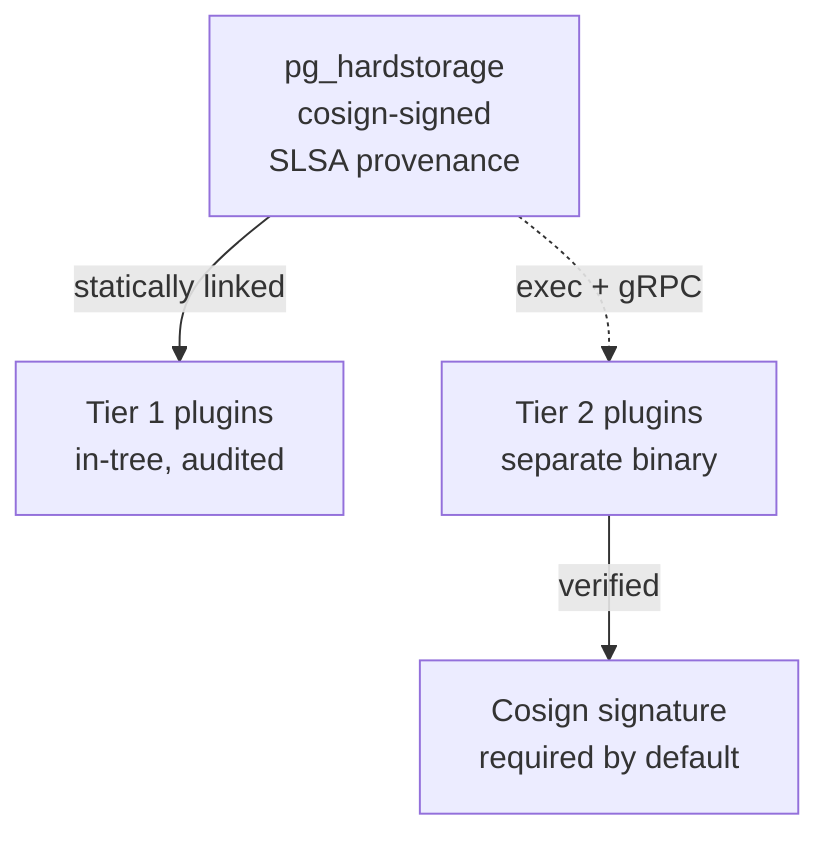

# Tier-1 vs Tier-2 plugins

Backup tools eventually grow a plugin surface — new storage
backends, new ciphers, new compressors, new alert sinks.  The
question is *where the trust boundary sits*.

`pg_hardstorage` cuts the surface in two:

- **Tier 1 plugins** (storage `fs` / `s3` / `gcs` / `azblob` /
  `sftp` / `scp`, KMS providers, compressors, sources, renderers,
  sinks) live in-tree, link statically, and ship as part of the
  signed binary.  One artifact, one signature, one FIPS-build
  path.
- **Tier 2 plugins** (third-party storage, third-party sinks,
  domain-specific extensions) ship as separate binaries discovered
  on `$HSPLUGIN_PATH`, talking to the agent over
  `hashicorp/go-plugin` (gRPC over Unix-domain stdio).
  Crash-isolated, language-agnostic.

This page explains the trust posture each tier implies, and why
the cut is at "first-party" and not at "trusted vs untrusted".

---

## What lives where (v1.0+)

| Kind | Tier 1 (in-tree, statically linked) | Tier 2 (separate binary, go-plugin) |
| --- | --- | --- |
| Storage (6) | `fs`, `s3`, `gcs`, `azblob`, `sftp`, `scp` | Vendor-specific |
| Encryption | `aesgcm` (chunk cipher) | rarely useful as Tier 2 |
| KMS (5) | `aws-kms`, `gcp-kms`, `azure-kv`, `vault-transit`, `pkcs11` (HSM) | Specialty HSMs |
| Compression | `zstd`, `none` | rarely useful as Tier 2 |
| Renderer (11) | `text`, `json`, `ndjson`, `yaml`, `template`, `csv`, `markdown`, `html`, `pdf`, `tap`, `junit` | Customer-specific |
| Sink (14) | `slack`, `webhook`, `syslog`, `pagerduty`, `email`, `cef`, `splunk-hec`, `datadog`, `jira`, `opsgenie`, `teams`, `otel-events`, `servicenow`, `discord` | Customer-specific |
| LLM provider | `openai` (OpenAI-compatible — covers Anthropic, OpenAI, Ollama, vLLM, Azure-OpenAI, Bedrock-Claude, etc. via the same wire format) | Vendors needing custom wire formats |
| Source | (no in-tree source plugin yet — `BASE_BACKUP` over the replication protocol is the data plane; the `SourcePlugin` interface for snapshot / pgincr17 sources remains future work) | Custom integrations |

The list isn't a value judgement.  It's "what does the project
maintain in its own CI" as of v1.0+.

---

## Why Tier 1 is statically linked

Three reasons, in priority order:

1. **One signed binary is easier to audit.**  Every release is
   one cosign signature, one SBOM, one SLSA provenance attestation.
   FedRAMP and similar compliance regimes ask for "did this
   binary you ran come from this source tree" — that question is
   trivial to answer when there is one binary.

2. **FIPS builds are simpler.**  `pg-hardstorage-fips` is the
   same binary built with `GOEXPERIMENT=boringcrypto`.  Every
   in-tree crypto path is FIPS-validated as a side effect.  A
   separately-loaded plugin would need its own FIPS story.

3. **Deployment is simpler.**  One binary in `/usr/bin`, one
   systemd unit, one Debian package.  The 90% case never
   discovers the plugin surface exists, and that's correct.

The cost is that adding a new Tier 1 plugin requires a binary
release.  We accept that cost — it forces us to maintain the
quality of what's in tree, and the release cadence is fast enough
that it doesn't bottleneck users.

---

## Why Tier 2 is `hashicorp/go-plugin`

Tier 2 exists for plugins we don't (or shouldn't) maintain
in-tree:

- **Vendor-specific storage backends** that the vendor wants to
  ship on their own cadence.
- **Customer-specific sinks** for proprietary alerting systems.
- **Specialty HSMs** that have small user bases but need
  first-class plugin support.

`hashicorp/go-plugin` gives us four useful properties:

1. **Crash isolation.**  A plugin segfault doesn't take down the
   agent.  The agent observes the plugin process exit, reports a
   structured error, and falls through to whatever fallback the
   caller chose (typically retry-with-degraded-mode).

2. **Language-agnostic.**  The wire protocol is gRPC over
   Unix-domain stdio.  Plugin authors can write in Go, Rust,
   Python — anything with a gRPC binding.

3. **Independent release cadence.**  A vendor can ship a new
   plugin without waiting for our release cycle.

4. **Independent trust posture.**  Plugin binaries are
   discovered on `$HSPLUGIN_PATH`; an operator decides whose
   binaries land there.  We can require cosign signatures by
   default and refuse unsigned plugins unless `--allow-unsigned-plugin`
   is used (audited, surfaced in `doctor`).

The cost: an extra process per plugin, extra IPC overhead, and
the operator's burden of trusting a plugin author's binary in
addition to ours.  We accept the cost where Tier 1 inclusion
isn't appropriate.

---

## Trust posture

**Tier 1 inherits the binary's trust posture.**  If you trust the
`pg_hardstorage` binary, you trust every Tier 1 plugin.  The same
SLSA Level 3 provenance covers them all.

**Tier 2 has its own trust posture, independent of ours.**
Default policy:

- Plugin binaries must carry a cosign signature.
- The signing key must be in a configured trust list (project
  registry post-v1.0, customer-managed before that).
- Loading an unsigned plugin requires `--allow-unsigned-plugin`,
  emits a critical audit event, and is recorded in every
  subsequent operation's audit trail.

This mirrors the [LLM safety stack](llm-safety-stack.md)'s
posture for skill files: signed by default, unsigned-with-flag
for development, the flag's use is audited.

---

## When does a plugin promote from Tier 2 to Tier 1?

Three rough criteria, in priority order:

1. **Demand.**  The plugin solves a problem for a meaningful
   chunk of the user base.
2. **Maintainability.**  The maintainers commit to in-tree
   maintenance, including tests and CI coverage.
3. **License compatibility.**  Apache 2.0 or compatible.

A typical promotion path: a customer ships a Tier 2 plugin for
their proprietary storage backend, the maintainers see it work in
production, the maintainers contribute it as Tier 1 once the
backend has multiple users.

---

## What's deferred

The Tier 2 *contracts* (interfaces, stdio JSON-RPC handshake,
plugin discovery via `$HSPLUGIN_PATH`, signature verification)
are shipped — v1.0 ships the runtime that loads a Tier 2
plugin.  See the
[build-a-storage-plugin tutorial](../tutorials/build-a-storage-plugin.md)
for a working example.

The public registry at `registry.pghardstorage.org` is post-v1.0.
Until the registry exists, Tier 2 is "load this signed binary I
gave you" — which is fine for customer-internal plugins but not
for community sharing.

---

## Further reading

- [Architecture tour: plugin tiers](architecture-tour.md#6-plugin-tiers)
  — the same material from the architecture-tour vantage.
- [Plugin reference](../reference/plugins/index.md) — the
  authoritative interface contracts.
- [LLM safety stack](llm-safety-stack.md) — the analogous
  signed-skill posture for the LLM helper.
