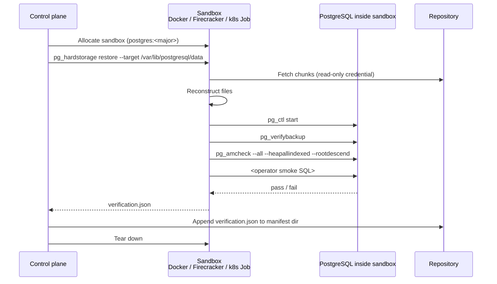

# Verify-sandbox tradeoffs — Docker vs Firecracker

The verifier subsystem is what makes a backup *real* — it
restores the backup into a sandbox PostgreSQL, runs
`pg_verifybackup`, runs `pg_amcheck`, runs the operator's smoke
SQL, and only marks the backup verified if all of those pass.

The interesting question is *what kind of sandbox*.  Two
choices ship: a Docker container (default) or a Firecracker
microVM (opt-in).  This page explains why both exist and how to
pick.

---

## What the verifier actually does

The verifier is **not** trusted with write access to the repo —
it has read-only credentials.  Its only outputs are the
verification report and the metric/audit events.  This means a
compromised sandbox cannot corrupt other backups.

---

## Two tiers — fast verify and full verify

| Tier | When | What it does | Sandbox required? |
| --- | --- | --- | --- |
| **Fast verify** | After every backup, < 60 s | `pg_verifybackup` against the staged manifest | No |
| **Full verify** | Default weekly, configurable | Restore into sandbox, run `pg_verifybackup` + `pg_amcheck` + smoke SQL | Yes |

Fast verify is just a manifest-level integrity check — chunk
hashes match, manifest signature validates, no chunks missing.
It runs in the agent process.  Cheap.

Full verify is the actual proof of restorability.  It needs a
sandbox because actually starting PostgreSQL on the restored data
directory is the only way to know the cluster comes up clean.

---

## Why Docker by default

Three reasons:

1. **It's already there.**  Most production hosts have Docker (or
   a compatible runtime — `podman`, `containerd`).  No
   provisioning step.

2. **Image availability.**  The official `postgres:<major>`
   images on Docker Hub are well-maintained and version-pinned.
   The verifier picks the image matching the backup's
   `pg_version` field.

3. **Fast enough.**  A typical container start is 1-3 s; the
   restore + verify cycle is dominated by chunk fetching, not
   sandbox setup.

The cost is that Docker shares the host kernel.  A privileged-
container escape from the verifier sandbox would land on the
host where the agent runs — which is a real concern in some
threat models.

---

## When Firecracker earns its setup cost

Firecracker (or `kata-containers`, or k8s `Job` with strict
PodSecurity) provides a separate kernel boundary.  Worth it
when:

- **The backup contains untrusted content.**  Most don't — the
  rows in your database aren't shellcode.  But there are
  scenarios (forensic backups of customer data, compliance
  contexts where the backup might contain web user uploads)
  where assuming the contents *aren't* hostile is a mistake.

- **The host runs other security-sensitive workloads.**
  Co-tenant on a host with a production agent → a kernel-level
  isolation makes the verifier unable to affect the rest of the
  host.

- **You want to verify backups in a different region or trust
  zone.**  Provisioning a Firecracker fleet for verification
  workloads gives you isolation from the agent's host fleet.

- **Compliance regimes ask specifically for "VM-level
  isolation".**  FedRAMP and some PCI configurations are explicit
  about this.

The cost:

- Firecracker setup is non-trivial.  KVM enabled on the host,
  the Firecracker binary in place, OCI image conversion to a
  Firecracker rootfs.
- Cold-start latency is higher (5-15 s vs 1-3 s for Docker).
- Resource overhead per microVM is real (a separate kernel per
  sandbox).

For a small fleet, Docker is the right answer.  For a large
multi-tenant SaaS where the sandbox might run untrusted content,
Firecracker pays for itself.

---

## The k8s `Job` middle ground (roadmap)

A k8s `Job` backend is on the roadmap, not yet shipped — only the
`docker` and `firecracker` backends are registered in the binary
today.  When it lands, the natural K8s sandbox is a `Job` running
in a dedicated namespace with strict `PodSecurity`:

- `runAsNonRoot: true`
- `readOnlyRootFilesystem: true`
- `seccompProfile: RuntimeDefault`
- `capabilities: drop: [ALL]`
- NetworkPolicy restricting egress to the repo and KMS only

This would sit between Docker and Firecracker on the isolation
spectrum.  The kernel boundary is the host's kernel, but the
combination of namespaces + cgroups + seccomp + minimal
capabilities is sufficient for most threat models.

Until it ships, K8s installs select `docker` or `firecracker`
explicitly via `Options.Backend`.

---

## What "passing verification" actually means

A backup with a `verification.json` reporting success has been
proven to:

- **Restore byte-identically** to its committed state.
  `pg_verifybackup` validates the manifest's per-file checksums.
- **Start as a working PostgreSQL instance.**  `pg_ctl start`
  succeeded; the cluster reached a normal state.
- **Pass deep block-level checks.**  `pg_amcheck` walked every
  index against its underlying heap and reported no
  inconsistencies.
- **Pass the operator's smoke SQL** if any was configured.
  Typical smoke SQL: SELECT counts on critical tables, foreign-
  key sanity checks, "does the application's bootstrap user
  exist".

A failing verification fires a metric, an audit event, and the
configured Sinks (Slack, PagerDuty, email).  The backup remains
in the repo — verification is not a gate to commit; it's a gate
to *trust*.

---

## Big-database sampling

Full verification of a 100 TB backup takes hours.  At that scale
the default policy is **sampled verification**: pick 5% of
backups per quarter for full verification; everything else gets
fast-verify.

This is auto-selected by the agent based on `manifest.size`.
The operator can override with `verify.policy` per deployment.
The audit log records which sampling decision was made for each
backup, so an auditor can reconstruct coverage.

---

## Further reading

- [Architecture tour: verifier]
  (architecture-tour.md#8-resilience-design) — where verification
  sits in the larger architecture.
- [Verify how-to](../how-to/verify/index.md) — the operator
  recipes.
- [Threat model](threat-model.md) — the attacker capabilities
  the sandbox is sized against.
