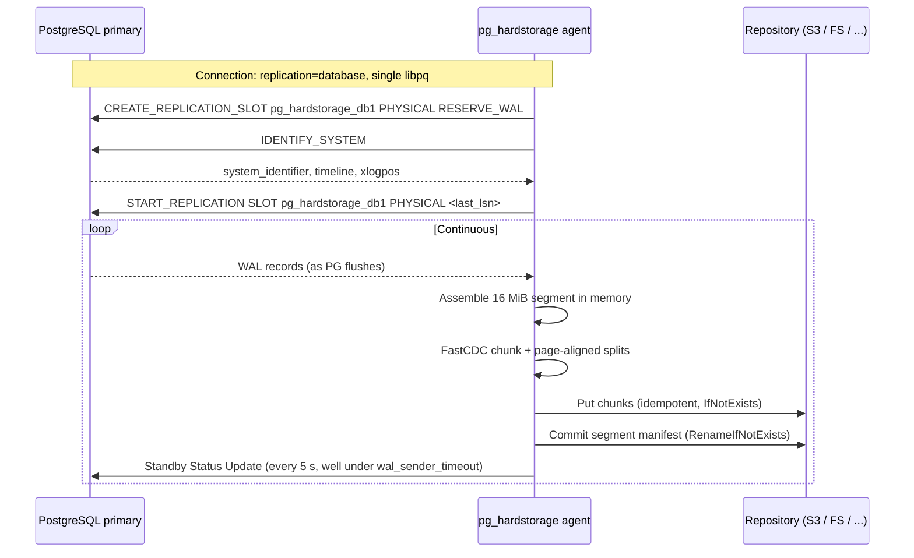

# WAL pipeline — streaming as the data plane

There are three traditional ways to get WAL out of PostgreSQL into
a backup repository: `archive_command` spawning a wrapper script,
the `archive_library` C extension, or a polling loop reading the
filesystem.  `pg_hardstorage` uses **none of them as the primary
path**.  The data plane is `START_REPLICATION` over libpq, fed
into a persistent physical replication slot.  Everything else is
optional.

This page explains what that buys us, what it costs us, and how
the agent decides which streaming mode to run.

---

## Why the replication protocol is the data plane

Three separate properties make the choice easy:

1. **It works on managed PostgreSQL.**  RDS, Cloud SQL, Azure
   Database, Aiven, Supabase, Neon — none of them let you install a
   C extension or SSH into the host.  All of them expose the
   replication endpoint.  Pull-based, file-based archive paths can
   fail invisibly on these providers; the replication slot can't.

2. **A persistent slot closes the WAL gap window.**  PG holds WAL
   in `pg_wal/` until the consumer (us) confirms the LSN with a
   `Standby Status Update`.  Network blips up to about 10 s are
   absorbed transparently.  Compare against `archive_command` which
   has no built-in retry semantics — your script either ran or
   didn't, and rerunning is the operator's problem.

3. **One credential model, one mental model.**  Base backup uses
   the replication protocol (`BASE_BACKUP`).  WAL flow uses the
   replication protocol (`START_REPLICATION ... PHYSICAL`).
   Logical decoding (when configured) uses the replication
   protocol (`START_REPLICATION ... LOGICAL`).  The agent has one
   PostgreSQL connection model, one replication user, one wire
   path — not three different transports stitched together.

The cost is a single load-bearing property: **PG holds WAL until
we ACK.**  Killing the agent for a long time will bloat
`pg_wal/` on the primary.  That's the conscious cost of the
no-gap guarantee.  See [the slot bloat
runbook](../reference/runbooks/index.md) for the operator side.

---

## What flows where



A few things worth highlighting:

- **`RESERVE_WAL` on slot creation.**  The slot's `restart_lsn` is
  populated immediately at create time, not at first
  `START_REPLICATION`.  This is what makes the streamer race-free:
  PG retains WAL from `restart_lsn` onwards from the moment the
  slot exists, so the gap between slot create and the first
  `START_REPLICATION` cannot lose data even on a busy primary.

- **The 16 MiB boundary** is intentional: it matches PG's WAL
  segment size, so the segment manifest naming aligns with what
  `pg_waldump` and `pg_receivewal` would have produced.

- **Per-segment commit** means a crash mid-segment loses at most
  one segment of in-memory work; the next reconnect resumes at the
  prior segment's stop LSN.

- **Keepalives every 5 s** are well under PG's
  `wal_sender_timeout` default of 60 s.  The 5 s figure is what
  lets us tolerate a 10 s network blip without the server
  declaring the connection dead.

- **Start-LSN safety floor.**  Before opening the streaming
  connection the agent re-reads the slot's `restart_lsn` and
  refuses to stream when the computed start LSN sits in a WAL
  segment older than the slot's pinned segment.  PG would
  otherwise either reject the request with "WAL segment X has
  already been removed" or silently start from `restart_lsn`,
  leaving our segment-numbering accounting wrong; the in-process
  check turns either failure mode into an actionable typed error
  (`wal.start_before_slot_restart_lsn`) before any wire I/O.

- **Auto-reconnect with EnsureSlot resume.**  A connection
  break (Patroni failover, PG bounce, network blip) returns
  from `replication.Stream` as a non-`context.Canceled` error.
  The streamer's retry loop sleeps with exponential backoff
  (1s → 30s by default), then re-runs preflight + IDENTIFY_SYSTEM
  + `EnsureSlot` against the leader-aware DSN — `EnsureSlot`'s
  Strategy A path finds a propagated slot, Strategy C recreates
  with `RESERVE_WAL`.  The start-LSN safety check then validates
  the resume position against the (possibly new) `restart_lsn`
  and streaming resumes.  `--no-reconnect` opts out for the rare
  one-shot use cases.

- **Graceful stop with `pg_switch_wal`.**  On SIGINT or SIGTERM
  the streamer opens a side regular-mode connection, runs
  `SELECT pg_switch_wal()` to seal the in-flight segment at the
  current insert position, and waits up to 5 s for the sink's
  `SyncedLSN` to advance past the switch point before
  cancelling the streaming context.  Without this, the most
  recent few MiB of WAL stayed in the streamer's per-segment
  buffer and were discarded on stop — PITR targets that fell
  inside the unflushed segment failed recovery with "recovery
  ended before configured recovery target was reached".  A
  second signal short-circuits the wait for impatient
  operators.

---

## Stream-startup preflight

`wal stream` runs a configuration preflight on the source
PostgreSQL before it touches the slot.  Same checks are reachable
standalone via `pg_hardstorage wal preflight <deployment>` for
setup runbooks and CI gates.

Fatal findings (refuse to start streaming):

- `wal_level.too_low` — physical replication needs `replica` or
  `logical`.
- `max_replication_slots.zero` / `.full` — slot table has no room.
- `max_wal_senders.zero` / `.saturated` — wal-sender pool is full.
- `role.no_replication` — the connecting role lacks the
  `REPLICATION` attribute.

Warning findings (proceed with the warning attached to the
start event):

- `max_slot_wal_keep_size.set` — caps slot retention, so a
  sustained streamer outage can still lose WAL.  Pair the cap
  with a streamer-lag alert; see
  [Replication-slot disk safety][slot-disk] for the trade-off
  against the disk-fill risk on the other side.
- `idle_replication_slot_timeout.set` (PG 17+) — idle slots get
  dropped silently.

Informational findings (no action required, but the policy is
worth knowing):

- `max_slot_wal_keep_size.unbounded` — the slot retains WAL
  until the streamer reconnects, which protects WAL but can
  fill `pg_wal/` if the streamer stays away too long.  Pair
  with disk-free and streamer-lag alerting; see
  [Replication-slot disk safety][slot-disk].

[slot-disk]: ../how-to/operating/slot-disk-safety.md

`--skip-preflight` is the explicit override; `--no-slot` is the
explicit escape hatch for archive-only setups that retain WAL
through some other mechanism.  Both emit loud start-event
warnings so the unsafe choice is visible in the audit trail.

---

## Streaming modes (auto-selected by topology)

The agent picks a mode by inspecting the database size and the
Patroni topology.  `doctor` reports which mode is active.

| Mode | When | What it does |
| --- | --- | --- |
| **Single-stream** | Default, < 5 TB | One slot on primary or replica.  The simple case. |
| **Replica-offload** | 5–50 TB | Slot on a Patroni replica.  Primary I/O is not loaded by the chunker.  Falls back to primary if the replica falls behind. |
| **Dual-stream** | 50+ TB or `availability=high` | **Two slots on two nodes** (typically primary + replica).  Both feed the same CAS chunk store.  Either stream can fail without RPO impact. |
| **Sync-target** | Spec aspiration — *not yet implemented* | A true synchronous standby must acknowledge WAL at record granularity; this streamer is segment-granular by construction and cannot.  What **does** ship is preflight *detection* of being placed in `synchronous_standby_names` (warning, or fatal under `remote_apply`).  See [Durability modes](durability-modes.md#what-this-is-not-a-synchronous-standby). |
| **Cascading** | Multi-region | Region-A agent streams from PG; Region-B agent streams from Region-A's repo, *not from PG*.  Primary load is independent of region count. |

Three properties hold across all modes:

- **CAS dedup makes redundant streams free.**  Dual-stream writes
  the same WAL twice but the second arrival of any chunk is a
  no-op at the chunker.  No double-storage, no double-egress on
  most backends.

- **Pre-flight verifies posture.**  `init` and `doctor` both check
  that the chosen mode is consistent with the topology — a
  dual-stream config against a single-node cluster is rejected at
  parse time, not at run time.

- **Mode is not a tier.**  Switching from single-stream to
  dual-stream is a config change.  Nothing in the repo schema
  changes; old manifests remain restorable; the new manifests gain
  a second stream's-worth of dedup-coverage and that's all.

The deeper treatment of dual-slot and sync-target — including how
they interact with Patroni failover — lives in [the Patroni
deep-dive](patroni-failover-deep-dive.md).

---

## Belt-and-suspenders archive paths (optional)

Some environments require classical `archive_*` paths for
regulatory reasons even when streaming is the truth-of-record.
Both shim into the same chunker pipeline:

- **`archive_library`** — a `pg_hardstorage_archive` C extension
  (~200 LOC) that calls a local agent over a Unix socket.  Optional
  install for paranoid double-archiving.  PG 15+.

- **`archive_command` shim** — `/usr/bin/pg_hardstorage wal push %p`
  for managed PG that doesn't expose `archive_library` and where
  customers want classical archiving alongside streaming.  Same
  chunker pipeline.

Both paths feed the same content-addressed chunk store.  CAS
dedup means the duplicate writes from streaming + archive cost
nothing in storage; on most backends they cost nothing in egress
either, because the second `Put` is short-circuited at the
chunker layer.

These are *optional* — they exist because regulated customers ask
for them, not because the streaming path is incomplete.  In
particular, the gap auditor described below treats them as
secondary inputs that can heal a hole the primary stream
introduced (e.g. after a slot recreation).

---

## WAL gap auditor and slot health

The slot guarantees no gaps as long as the slot exists.  Three
things can introduce a gap:

- **An admin drops the slot.**  This happens — `pg_drop_replication_slot()`
  is a single SQL statement.  We catch it on the next reconnect
  with `IDENTIFY_SYSTEM` and report it loudly.

- **Patroni promotes a new leader and the slot doesn't follow
  cleanly.**  The full treatment is in [the Patroni deep-dive]
  (patroni-failover-deep-dive.md).  The short version: with
  Patroni `permanent_slots` (Strategy A) the gap is sub-second;
  with the v0.1 fallback (Strategy C) the gap is real and
  reported.

- **`max_slot_wal_keep_size` is reached.**  PG drops our retained
  WAL to free disk space.  We alert before this happens by
  watching `pg_replication_slots.wal_status` and the
  `pg_hardstorage_wal_archive_lag_bytes` metric.

The auditor itself is a periodic job:

- Lists segments in repo, asserts no LSN holes between consecutive
  segment manifests on each timeline.
- Reports gaps as `wal_gap_detected` events with severity, LSN
  bounds, and timeline.
- Surfaces the last good LSN per timeline in `doctor` output.
- Refuses PITR into a gap window with a clear, structured error.

`pg_hardstorage wal repair <deployment>` is the explicit operator
action that drops and recreates the slot, accepting whatever WAL
gap that introduces.  `repair wal --gaps --source <secondary>` can
fill a detectable hole from a redundant stream when one exists.

---

## What the manifests record

Every backup manifest carries the timeline it ended on plus the
list of WAL segments needed to replay to its `stop_lsn`:

```json
{
  "timeline": 2,
  "start_lsn": "0/3000028",
  "stop_lsn":  "0/30001A0",
  "wal_required": ["000000020000000000000003"]
}
```

PITR walks the timeline-history files in
`wal/<deployment>/timelines/` to reconstruct the chain across
failovers.  PG's recovery understands timeline history natively;
we just need to ensure all `.history` files are in the repo at
restore time, which the agent fetches on every connection.

---

## Further reading

- [Patroni failover deep-dive](patroni-failover-deep-dive.md) —
  the four mechanisms that keep streaming honest across leader
  changes.
- [Durability modes](durability-modes.md) — when the chunks a
  segment is made of actually hit stable storage; `per-segment`
  vs `per-chunk`; the sync-standby detection in detail.
- [Content-addressed storage](content-addressed-storage.md) — what
  the chunker downstream of the WAL receiver actually does.
- [R6 — Slot dropped, gap detected](../reference/runbooks/R6-slot-dropped-gap.md)
  — the operator runbook for slot loss.
- [Architecture tour: WAL via the replication protocol](architecture-tour.md#2-wal-via-the-replication-protocol)
  — the same material from the architecture-tour vantage.
