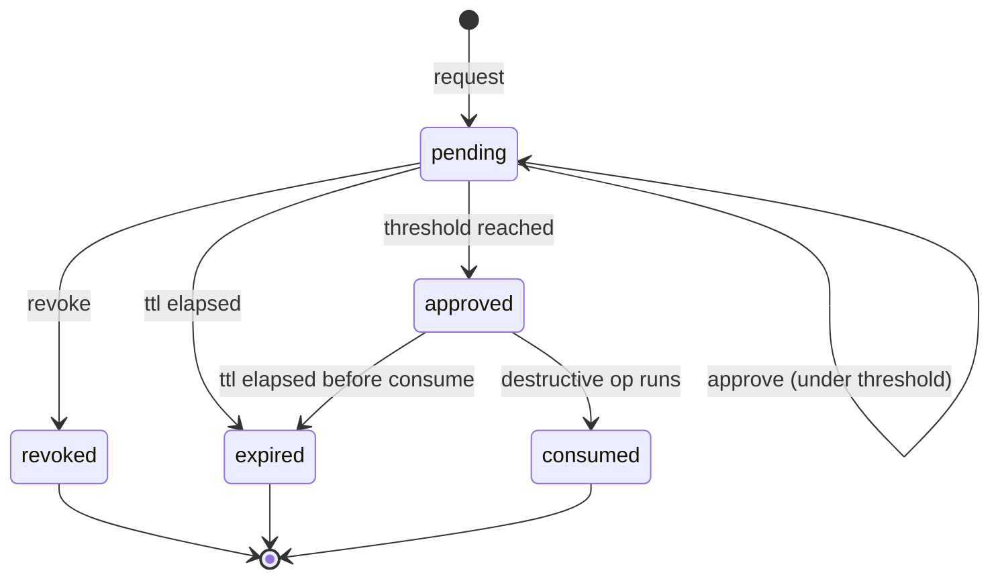

# n-of-m approvals

> Multi-operator gate for the kind of action that can't be
> undone. An initiator creates a Request specifying the op,
> target, reason, TTL, threshold N, and the public keys of the
> M operators allowed to approve. Each approver signs an
> approval; once N distinct allowlisted approvers have signed,
> the request flips to **approved** and the destructive op can
> proceed.

## Operations that require approval

| Op | Where it's enforced |
| --- | --- |
| `kms.shred` | [`kms shred`](crypto-shred.md) |
| `repo.wipe` | [`repo wipe`](../../reference/cli/pg_hardstorage_repo_wipe.md) |
| `backup.delete --force` | force-delete on a backup |
| Future: any op flagged by SOC 2 / ISO 27001 control mapping |

The gate is part of the destructive command itself; bypassing
the approval is not an operator surface.

## What you need

- A repository where the request lands (the same repo the op
  will affect).
- Each approver's **ed25519 public-key PEM**. This is the
  same shape as the manifest-signing keys the binary already
  uses; reuse the keyring's `signing.pub` or generate fresh
  pairs with [`age-keygen`](https://github.com/FiloSottile/age)
  / `ssh-keygen -t ed25519 -m PEM`.
- For each approver: their **private key PEM**, kept on the
  approver's host (mode 0600).

## Steps

### 1. Open a request

```bash
pg_hardstorage approval request \
    --repo file:///srv/pg_hardstorage/repo \
    --op kms.shred \
    --target /etc/pg_hardstorage/keys \
    --reason "GDPR Art 17 #4421 — subject deletion request" \
    --threshold 2 \
    --ttl 24h \
    --approver-key /etc/pg_hardstorage/approvers/alice.pub \
    --approver-key /etc/pg_hardstorage/approvers/bob.pub \
    --approver-key /etc/pg_hardstorage/approvers/carol.pub
```

```console
request_id:  apr-2026-04-28-7f3a1b2c
op:          kms.shred
target:      /etc/pg_hardstorage/keys
threshold:   2 of 3
ttl:         24h0m0s
status:      pending
created_at:  2026-04-28T14:21:08Z
```

The request is signed against the operator's keypair and
written to the repo. Tampering with the request body
invalidates every existing approval.

### 2. Each approver fetches and decides

```bash
# On Alice's machine
pg_hardstorage approval status apr-2026-04-28-7f3a1b2c \
    --repo file:///srv/pg_hardstorage/repo
```

```console
op:           kms.shred
target:       /etc/pg_hardstorage/keys
reason:       GDPR Art 17 #4421 — subject deletion request
threshold:    2 of 3 (1 approval so far)
status:       pending
ttl_remaining: 23h47m
approvers:
  - alice.pub  (not signed)
  - bob.pub    (not signed)
  - carol.pub  (signed at 2026-04-28T14:24:11Z)
```

If Alice agrees:

```bash
pg_hardstorage approval approve apr-2026-04-28-7f3a1b2c \
    --repo file:///srv/pg_hardstorage/repo \
    --approver alice@acme.example.com \
    --key /home/alice/.ssh/pg_hardstorage_alice.pem \
    --reason "I confirm subject 4421's deletion is in flight"
```

`--approver` is the operator-readable identifier (email is the
common pick); it appears in the audit chain alongside the
ed25519 signature.

### 3. Watch for "approved"

```bash
pg_hardstorage approval status apr-2026-04-28-7f3a1b2c \
    --repo file:///srv/pg_hardstorage/repo
```

```console
op:           kms.shred
target:       /etc/pg_hardstorage/keys
threshold:    2 of 3 (2 approvals — APPROVED)
status:       approved
approved_at:  2026-04-28T14:31:42Z
ttl_remaining: 23h36m
approvers:
  - alice.pub  (signed at 2026-04-28T14:31:42Z by alice@acme.example.com)
  - bob.pub    (not signed)
  - carol.pub  (signed at 2026-04-28T14:24:11Z by carol@acme.example.com)
```

### 4. Consume the approval

```bash
pg_hardstorage kms shred \
    --confirm-keyring /etc/pg_hardstorage/keys \
    --reason "GDPR Art 17 #4421" \
    --yes
```

The destructive command finds the approved request whose
`(op, target)` matches and consumes it. A single approval is
single-use — the destructive op atomically marks it consumed
to prevent replay.

### 5. (Optional) Revoke a request before approval

```bash
pg_hardstorage approval revoke apr-2026-04-28-7f3a1b2c \
    --repo file:///srv/pg_hardstorage/repo \
    --reason "Wrong target — opened against staging keyring"
```

A revoked request cannot be approved further. Re-open with the
correct target.

### 6. List pending requests (audit)

```bash
pg_hardstorage approval list \
    --repo file:///srv/pg_hardstorage/repo
```

```console
ID                         OP          TARGET                       THRESHOLD  STATUS    TTL_REMAINING
apr-2026-04-28-7f3a1b2c    kms.shred   /etc/pg_hardstorage/keys     2 of 3     approved  23h36m
apr-2026-04-27-3e1f9a04    repo.wipe   s3://acme-pg-backups/        3 of 5     pending   8h12m
```

## Threshold sizing

| Threshold | When it fits |
| --- | --- |
| `2 of 3` | Two-eyes principle, with one floater for vacation cover. The minimum that defends against a single compromised credential. |
| `3 of 5` | Higher-stakes operations on regulated workloads. Survives one out + one absent without blocking the op. |
| `4 of 7` | Highest tier — board-level / fiduciary destructions. Most regulated environments don't need this; pick smaller unless an audit specifically calls for it. |

`--threshold 1` is technically allowed but defeats the
purpose. `--threshold 0` is rejected.

## Approval lifecycle states



`expired` and `consumed` requests stay in the audit chain
indefinitely — the request body itself records the full
history.

## Audit trail

Every state transition emits an event into the
[hash-chained audit log](../../operations/operator-guide.md#8-audit-log):

- `approval.requested`
- `approval.signed` (one per approver signature)
- `approval.approved` (threshold reached)
- `approval.consumed` (destructive op ran)
- `approval.revoked`
- `approval.expired`

The chain links the approval to the destructive op via
`request_id`.

## Troubleshooting

**`approval.threshold_below_one`** — `--threshold 0`. Pick at
least 1.

**`approval.unknown_approver`** — the approver's public key
isn't in the request's allowlist. Either the keyfile changed
or you're using the wrong keypair. Compare against the
approver-key paths from the request.

**`approval.signature_invalid`** — the approver's signature
doesn't verify. Did the request body change since signing?
Re-fetch and re-sign.

**`approval.expired`** — the TTL elapsed. Re-open with a
longer TTL.

**Destructive op refuses the consumption** — the op's
`(op, target)` tuple doesn't exactly match the request.
`kms.shred` against `/etc/pg_hardstorage/keys` matches a
request with `op=kms.shred, target=/etc/pg_hardstorage/keys`,
but **not** `target=/etc/pg_hardstorage/keys/`. Trailing
slashes matter; the canonical form is what `kms inspect`
reports.

## Next steps

- [Crypto-shred](crypto-shred.md) — the canonical use case
- [Audit log](../../operations/operator-guide.md#8-audit-log)
- [`approval` CLI reference](../../reference/cli/pg_hardstorage_approval.md)
