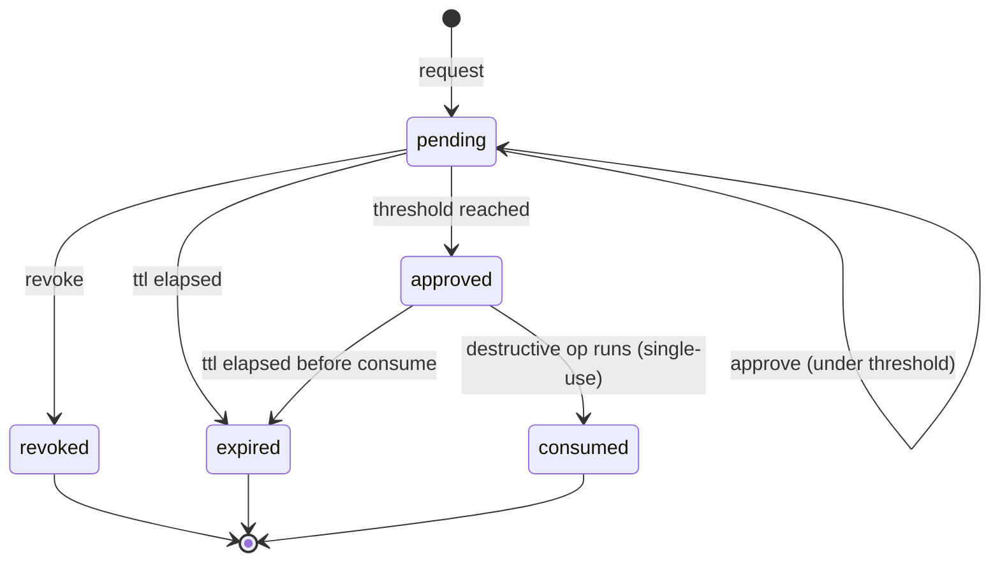

# n-of-m approvals

> Multi-operator gate for the kind of action that can't be
> undone. An initiator creates a Request specifying the op,
> target, reason, TTL, threshold N, and the public keys of the
> M operators allowed to approve. Each approver signs an
> approval; once N distinct allowlisted approvers have signed,
> the request flips to **approved** and the destructive op can
> proceed.

## Operations that require approval

| Op | Where it's enforced |
| --- | --- |
| `kms.shred` | [`kms shred`](crypto-shred.md) |
| `repo.wipe` | [`repo wipe`](../../reference/cli/pg_hardstorage_repo_wipe.md) |
| `backup.delete --force` | force-delete on a backup |
| Future: any op flagged by SOC 2 / ISO 27001 control mapping |

The gate is part of the destructive command itself; bypassing
the approval is not an operator surface.

## What you need

- A repository where the request lands (the same repo the op
  will affect).
- Each approver's **ed25519 public-key PEM**. This is the
  same shape as the manifest-signing keys the binary already
  uses; reuse the keyring's `signing.pub` or generate fresh
  pairs with [`age-keygen`](https://github.com/FiloSottile/age)
  / `ssh-keygen -t ed25519 -m PEM`.
- For each approver: their **private key PEM**, kept on the
  approver's host (mode 0600).

## Configure the trusted approver roster

The request body lives in the repository, so anything in it — the
approver keys and the threshold included — was chosen by whoever
wrote it. The gate therefore does **not** trust the request's own
key list: it counts only votes from keys on the **trusted approver
roster** configured on the host that runs the destructive op, and it
requires at least the **configured minimum** number of them.

| Setting | Default | Meaning |
| --- | --- | --- |
| `PG_HARDSTORAGE_APPROVAL_ROSTER` | `<config-dir>/approvers` | A directory of ed25519 public-key PEMs (`*.pem`, `*.pub`), or one file holding several PEM blocks. |
| `PG_HARDSTORAGE_APPROVAL_MIN_THRESHOLD` | `2` | Minimum distinct trusted approvals any gated op needs, whatever the request's `--threshold` says. |

```bash
install -d -m 0755 /etc/pg_hardstorage/approvers
install -m 0644 alice.pub bob.pub carol.pub /etc/pg_hardstorage/approvers/
```

With no roster configured the gate refuses every approval
(fail-closed). `approval request` checks the same policy and refuses
a request that could never be redeemed: an approver key that is not
on the roster (`auth.approver_untrusted`, exit 3) or a `--threshold`
below the minimum (`usage.threshold_below_policy`, exit 2). Manage
the roster like the keyring — root-owned, not writable by the
accounts that can write to the repository.

## Steps

### 1. Open a request

```bash
pg_hardstorage approval request \
    --repo file:///srv/pg_hardstorage/repo \
    --op kms.shred \
    --target /etc/pg_hardstorage/keyring \
    --reason "GDPR Art 17 #4421 — subject deletion request" \
    --threshold 2 \
    --ttl 24h \
    --approver-key /etc/pg_hardstorage/approvers/alice.pub \
    --approver-key /etc/pg_hardstorage/approvers/bob.pub \
    --approver-key /etc/pg_hardstorage/approvers/carol.pub
```

```console
✓ approval request created
  ID:        appr-6a4bb4064d13c6f0
  Op:        kms.shred
  Target:    /etc/pg_hardstorage/keyring
  Threshold: 2 of 3 allowlisted approvers
  Expires:   2026-07-07T13:56:22Z
  Approve:   pg_hardstorage approval approve appr-6a4bb4064d13c6f0 --repo <url>
```

The request is signed against the operator's keypair and
written to the repo. Tampering with the request body
invalidates every existing approval.

### 2. Each approver fetches and decides

```bash
# On Alice's machine
pg_hardstorage approval status appr-6a4bb4064d13c6f0 \
    --repo file:///srv/pg_hardstorage/repo
```

```console
approval appr-6a4bb4064d13c6f0
  Op:           kms.shred
  Initiator:    hardstorage
  Target:       /etc/pg_hardstorage/keyring
  Reason:       GDPR Art 17 #4421 — subject deletion request
  Status:       pending (1/2 approvals)
  Expires:      2026-07-07T13:56:22Z
  Approvals:
    2026-07-06T13:56:34Z  carol@acme.example.com  confirm subject 4421 deletion
```

If Alice agrees:

```bash
pg_hardstorage approval approve appr-6a4bb4064d13c6f0 \
    --repo file:///srv/pg_hardstorage/repo \
    --approver alice@acme.example.com \
    --key /home/alice/.ssh/pg_hardstorage_alice.pem \
    --reason "I confirm subject 4421's deletion is in flight"
```

`--approver` is the operator-readable identifier (email is the
common pick); it appears in the audit chain alongside the
ed25519 signature.

### 3. Watch for "approved"

```bash
pg_hardstorage approval status appr-6a4bb4064d13c6f0 \
    --repo file:///srv/pg_hardstorage/repo
```

```console
approval appr-6a4bb4064d13c6f0
  Op:           kms.shred
  Initiator:    hardstorage
  Target:       /etc/pg_hardstorage/keyring
  Reason:       GDPR Art 17 #4421 — subject deletion request
  Status:       approved (2/2 approvals)
  Expires:      2026-07-07T13:56:22Z
  Approvals:
    2026-07-06T13:56:42Z  alice@acme.example.com  I confirm subject 4421's deletion is in flight
    2026-07-06T13:56:34Z  carol@acme.example.com  confirm subject 4421 deletion
```

### 4. Consume the approval

```bash
pg_hardstorage kms shred \
    --repo file:///srv/pg_hardstorage/repo \
    --require-approval appr-6a4bb4064d13c6f0 \
    --confirm-keyring /etc/pg_hardstorage/keyring \
    --reason "GDPR Art 17 #4421" \
    --yes
```

The destructive command checks that the request is approved by
enough trusted approvers, still within its TTL, and bound to exactly
this `(op, target)` — a request filed without a target authorises
nothing — and then consumes it. A single approval is single-use: the
gate writes a write-once consumption marker
(`approvals/<id>/consumed.json`) before the op runs, so of two
concurrent redemptions exactly one proceeds, and an op that fails
after the gate has still spent its approval (open a new request to
retry). `approval status` shows `Redeemed:` once it is consumed.

### 5. (Optional) Revoke a request before approval

```bash
pg_hardstorage approval revoke appr-6a4bb4064d13c6f0 \
    --repo file:///srv/pg_hardstorage/repo \
    --reason "Wrong target — opened against staging keyring"
```

A revoked request cannot be approved further. Re-open with the
correct target.

### 6. List pending requests (audit)

```bash
pg_hardstorage approval list \
    --repo file:///srv/pg_hardstorage/repo
```

```console
ID                     OP         STATUS    APPROVALS  EXPIRES               TARGET
appr-6a4bb4064d13c6f0  kms.shred  approved  2/2        2026-07-07T13:56:22Z  /etc/pg_hardstorage/keyring
appr-3e1f9a04c2b18d5a  repo.wipe  pending   1/3        2026-07-06T22:12:00Z  s3://acme-pg-backups/
```

## Threshold sizing

| Threshold | When it fits |
| --- | --- |
| `2 of 3` | Two-eyes principle, with one floater for vacation cover. The minimum that defends against a single compromised credential. |
| `3 of 5` | Higher-stakes operations on regulated workloads. Survives one out + one absent without blocking the op. |
| `4 of 7` | Highest tier — board-level / fiduciary destructions. Most regulated environments don't need this; pick smaller unless an audit specifically calls for it. |

`--threshold 1` is refused unless the operator lowers
`PG_HARDSTORAGE_APPROVAL_MIN_THRESHOLD` to 1 — a single approver
defeats the purpose. `--threshold 0` is rejected.

## Approval lifecycle states


```mermaid
stateDiagram-v2
    [*] --> pending: request
    pending --> pending: approve (under threshold)
    pending --> approved: threshold reached
    pending --> revoked: revoke
    pending --> expired: ttl elapsed
    approved --> consumed: destructive op runs (single-use)
    approved --> expired: ttl elapsed before consume
    revoked --> [*]
    expired --> [*]
    consumed --> [*]
```

`expired` and `consumed` requests stay in the audit chain
indefinitely — the request body itself records the full
history.

## Audit trail

Every state transition emits an event into the
[hash-chained audit log](../../operations/operator-guide.md#8-audit-log):

- `approval.requested`
- `approval.signed` (one per approver signature)
- `approval.approved` (threshold reached)
- `approval.consumed` (destructive op ran)
- `approval.revoked`
- `approval.expired`

The chain links the approval to the destructive op via
`request_id`.

## Troubleshooting

**`approval.threshold_below_one`** — `--threshold 0`. Pick at
least 1.

**`approval.unknown_approver`** — the approver's public key
isn't in the request's allowlist. Either the keyfile changed
or you're using the wrong keypair. Compare against the
approver-key paths from the request.

**`approval.signature_invalid`** — the approver's signature
doesn't verify. Did the request body change since signing?
Re-fetch and re-sign.

**`approval.expired`** — the TTL elapsed. This applies to approved
requests too: an approval that was never redeemed lapses at its TTL.
Re-open with a longer TTL.

**`approval.gate_failed` … not enough approvals from the trusted
approver roster** — the request's votes come from keys that are not
on this host's roster, or fewer than the configured minimum. Check
`PG_HARDSTORAGE_APPROVAL_ROSTER` / `PG_HARDSTORAGE_APPROVAL_MIN_THRESHOLD`
on the host running the op.

**`approval.gate_failed` … already redeemed** — approvals are
single-use. Open a new request.

**`config.approval_roster_missing`** — no trusted approver roster is
configured; see [Configure the trusted approver roster](#configure-the-trusted-approver-roster).

**Destructive op refuses the consumption** — the op's
`(op, target)` tuple doesn't exactly match the request.
`kms.shred` against `/etc/pg_hardstorage/keys` matches a
request with `op=kms.shred, target=/etc/pg_hardstorage/keys`,
but **not** `target=/etc/pg_hardstorage/keys/`. Trailing
slashes matter; the canonical form is what `kms inspect`
reports.

## Next steps

- [Crypto-shred](crypto-shred.md) — the canonical use case
- [Audit log](../../operations/operator-guide.md#8-audit-log)
- [`approval` CLI reference](../../reference/cli/pg_hardstorage_approval.md)
