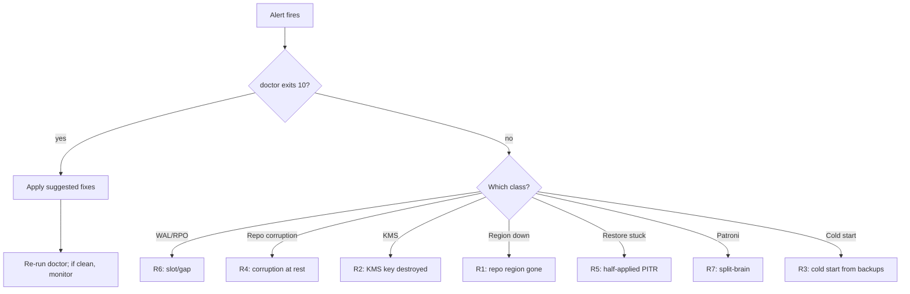

# Incident response

3am-tuned symptom → action mapping. Use this page as the
first read after the alert fires; each row points at a
runbook (R1–R7) for the full playbook.

If you are reading this BEFORE an incident: also look at
[troubleshooting.md](troubleshooting.md) for symptom-keyed
diagnostics and at the
[runbook index](../reference/runbooks/index.md) for the
seven full disaster runbooks.

---

## First five minutes

Whatever fired, first run:

```sh
pg_hardstorage doctor
pg_hardstorage status
```

`doctor` returns one finding per deployment with a suggested
fix. `status` returns RPO and the next scheduled run for each
deployment. Together they answer "what's broken and how
recent is the data we'd restore from?" — the two questions
that gate every other decision.

If `doctor` exits 10 (`doctor.issues_present`), run the
command `doctor` suggests for each finding, one at a time,
after acknowledging each.

---

## Symptom matrix

| Alert / symptom | Most likely cause | First action | Runbook |
| --- | --- | --- | --- |
| `HSWALSilence`, `wal.slot_missing` | Replication slot dropped | `pg_hardstorage wal repair <deployment>` | [R6](../reference/runbooks/R6-slot-dropped-gap.md) |
| `HSWALSilence`, slot present, lag rising | Network partition or PG primary stuck | Check `pg_replication_slots`; verify libpq reachability | [R6](../reference/runbooks/R6-slot-dropped-gap.md) |
| `HSBackupOverdue`, RPO target exceeded | Schedule paused / agent down | `pg_hardstorage status <deployment>`; rerun `backup` manually | [R3](../reference/runbooks/R3-cold-start-from-backups.md) |
| `HSKEKUnreachable`, `kms.unreachable` | KMS provider degraded or IAM revoked | Check provider console; restore IAM grants | [R2](../reference/runbooks/R2-kms-key-destroyed.md) |
| `HSScrubFindings{kind="bit-rot"}` | Chunk corruption at rest | Quarantine prefix; heal from replica region | [R4](../reference/runbooks/R4-repo-corruption-at-rest.md) |
| `HSScrubFindings{kind="missing"}` | Manifest references absent chunk | `repo check` to confirm; restore from replica | [R4](../reference/runbooks/R4-repo-corruption-at-rest.md) |
| `HSVerifyFailures` on `tier="fast"` | Encryption or storage corruption | Cross-check a different backup; if also failing, treat as repo corruption | [R4](../reference/runbooks/R4-repo-corruption-at-rest.md) |
| `HSVerifyFailures` on `tier="full"` | Backup unrestorable; PG-level damage | Promote a different backup; investigate source database | [R3](../reference/runbooks/R3-cold-start-from-backups.md) |
| `verify.audit_chain_broken` | Audit-log tamper or storage corruption | `audit verify-chain` for the bad event ID; freeze repo | [R4](../reference/runbooks/R4-repo-corruption-at-rest.md) |
| `repo region gone` (S3 bucket deleted, region outage) | Disaster scenario | Promote replica region; rotate KEK refs | [R1](../reference/runbooks/R1-repo-region-gone.md) |
| `kms.shred` accidentally executed | Backups for tenant T unrecoverable | Document affected backups; honour as compliance event; restore older snapshots if any predate the KEK | [R2](../reference/runbooks/R2-kms-key-destroyed.md) |
| Restore halted with state file present in target | Half-applied PITR | Roll back to staging; rerun with `--target` clean | [R5](../reference/runbooks/R5-half-applied-pitr.md) |
| `HSAnomalyHigh{kind="size"}` | Table dropped, bulk import, replication broken | Compare manifest sizes via `backup compare`; investigate workload | [troubleshooting.md](troubleshooting.md) |
| Patroni split-brain detected | Two primaries — refuse all backups | Resolve in DCS first; resume only after lone leader | [R7](../reference/runbooks/R7-patroni-split-brain.md) |

---

## Decision tree



---

## Triage commands cheat-sheet

```sh
# Health
pg_hardstorage doctor [<deployment>]
pg_hardstorage status [<deployment>]

# Inspect a specific backup
pg_hardstorage list <deployment>
pg_hardstorage show <deployment> <backup-id>

# Verify on the spot
pg_hardstorage verify <deployment> latest --repo <url>
pg_hardstorage repair scrub <repo-url>

# Audit chain integrity
pg_hardstorage audit verify-chain --repo <url>
pg_hardstorage audit search --deployment <d> --since 24h

# WAL diagnosis
pg_hardstorage wal list <d> --repo <url>
pg_hardstorage wal repair <deployment>
pg_hardstorage wal gaps <d> --repo <url>

# Capacity / cost (post-incident retrospective)
pg_hardstorage capacity report --repo <url>
pg_hardstorage cost report --repo <url>
```

---

## Pre-flight refusals (refuse-don't-corrupt)

The binary refuses to mutate state in known-broken
configurations. The refusals are the **first defence** — many
incidents resolve by reading the refusal and running the
suggested fix.

| Refusal code | Meaning | Suggestion |
| --- | --- | --- |
| `verify.signature_mismatch` | Manifest's Ed25519 signature failed | Verify the keyring; restore from replica |
| `verify.scrub_mismatch` | Chunk's plaintext SHA-256 disagrees with manifest | [R4](../reference/runbooks/R4-repo-corruption-at-rest.md) |
| `verify.audit_chain_broken` | Audit chain's hash links don't match | Freeze repo; investigate tamper |
| `verify.missing_chunks` | Live manifest references a chunk not in CAS | [R4](../reference/runbooks/R4-repo-corruption-at-rest.md) |
| `wal.slot_missing` | Replication slot dropped on primary | `wal repair <deployment>` |
| `wal_gap_detected` | Recorded gap in WAL inventory | Decide: accept loss + new full, or use `wal repair` |
| `pg.connect_timeout` | libpq could not connect within 30s | Check `pg_hba.conf`, firewall, port |
| `kms.unreachable` | KMS provider unreachable | Wait or fail over; do not force-mutate |
| `patroni.split_brain` | Two leaders in DCS | [R7](../reference/runbooks/R7-patroni-split-brain.md) |
| `repo.tombstoned` | Operation targets a tombstoned manifest | Check `rotate` history; undelete if appropriate |

Every refusal carries a `Suggestion` field with the exact
remediation command. Refusals are exit code 4
(pre-flight failed) and never mutate state.

---

## Post-incident

Once the incident is resolved:

1. **Capture forensic state.** Export an audit evidence
   bundle that covers the incident window:

   ```sh
   pg_hardstorage audit export-bundle \
       --repo <url> \
       --since "2026-04-28T03:00:00Z" \
       --until "2026-04-28T09:00:00Z" \
       --include-anchors \
       --out ./incident-2026-04-28.tar.gz
   ```

   See [audit evidence bundles](../compliance/audit-evidence-bundles.md)
   for the format.

2. **Run a drill.** Trigger an out-of-cycle recovery drill
   into a different region:

   ```sh
   pg_hardstorage recovery drill <deployment>
   ```

   The drill records actual RTO vs SLO target.

3. **Update the SLO.** If the SLO target was missed, update
   it to reflect actual capacity rather than aspirational
   targets:

   ```sh
   pg_hardstorage slo set <deployment> --rpo 4h --rto 30m
   ```

4. **Schedule a retrospective.** The audit chain plus the
   evidence bundle is your write-up's primary source.

---

## Further reading

- [Runbook R1: repo region gone](../reference/runbooks/R1-repo-region-gone.md)
- [Runbook R2: KMS key destroyed](../reference/runbooks/R2-kms-key-destroyed.md)
- [Runbook R3: cold start from backups](../reference/runbooks/R3-cold-start-from-backups.md)
- [Runbook R4: repo corruption at rest](../reference/runbooks/R4-repo-corruption-at-rest.md)
- [Runbook R5: half-applied PITR](../reference/runbooks/R5-half-applied-pitr.md)
- [Runbook R6: slot dropped, gap](../reference/runbooks/R6-slot-dropped-gap.md)
- [Runbook R7: Patroni split-brain](../reference/runbooks/R7-patroni-split-brain.md)
- [Troubleshooting](troubleshooting.md)
- [Alerting recipes](alerting-recipes.md)
