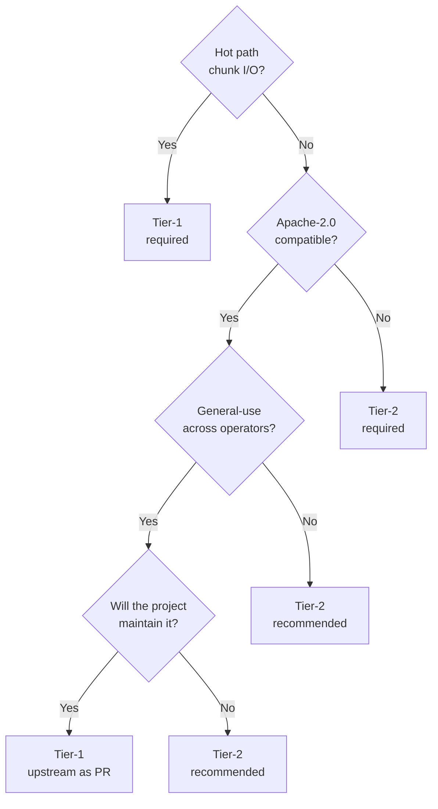

# Tier-1 vs Tier-2: choosing a plugin tier

Two paths to extend `pg_hardstorage`.  This page is the
decision matrix.

## TL;DR

| Pick Tier-1 if… | Pick Tier-2 if… |
| --- | --- |
| You're a contributor to pg_hardstorage and the plugin is reusable across operators. | You're a vendor or end customer shipping plugin logic specific to one deployment / proprietary system. |
| The hot path matters (chunk I/O during backup / restore). | The path is cold (init, doctor, occasional config refresh). |
| You need FIPS-strict, SLSA L3 build attestation. | You're OK with operator-trust posture and per-binary verification. |
| You want one signed binary, one CVE story, one supply chain. | You want crash isolation and language independence. |
| The plugin will be in-tree under the project license (Apache-2.0). | The plugin is closed-source / commercial / customer-bespoke. |

## Detailed comparison

| Concern | Tier-1 (in-tree) | Tier-2 (separate binary) |
| --- | --- | --- |
| **How discovered** | Compile-time `_ "…/internal/plugin/x/y"` import in `cmd/pg_hardstorage/main.go` | Runtime walk of `$HSPLUGIN_PATH` for `pg-hardstorage-plugin-*` executables |
| **How invoked** | Direct Go call against the registered factory | One-shot subprocess per RPC; stdio JSON-RPC v1 (gRPC-over-`hashicorp/go-plugin` v1.1+) |
| **Per-call latency** | ~1 µs (function call) | ~10–200 ms (process spawn + protocol handshake + SDK init) |
| **Hot-path suitability** | Yes — designed for chunk I/O on every backup write | No — exec-per-call overhead dominates |
| **Crash blast radius** | Plugin panic = process exit | Plugin crash = subprocess failure; host marks plugin failed and continues |
| **Language** | Go | Any language with a JSON encoder (gRPC for v1.1+) |
| **Build flavours** | Inherits host build (FIPS / non-FIPS, OS / arch) | Independent build per plugin |
| **Supply chain** | One signed binary; one SBOM; one CVE feed | One binary per plugin; operator audits each |
| **Versioning** | Locked to `pg_hardstorage` SemVer | Plugin declares its own SemVer + protocol version; mismatched protocol = clean refusal at handshake |
| **License** | Apache-2.0 (project license) | Author's choice |
| **Audit trail** | Linked binary set fixed at build | Each plugin's path, version, and SHA-256 logged at startup; `pg_hardstorage plugin list` lists them |
| **`--fips-strict` posture** | Inherited from host binary | Plugin must declare its own FIPS posture; mixed-mode is refused |
| **Distribution** | Ships in the `pg_hardstorage` release artifact | Operator installs to `/usr/local/lib/pg_hardstorage/plugins/` (or container image overlay) |
| **CI / test integration** | Run by the project's test suite (`go test ./...`) | Plugin author's own CI; integration smoke-test via `pg_hardstorage plugin test ./pg-hardstorage-plugin-foo` |

## Performance reality check

Tier-2's per-call cost is dominated by:

1. **Process spawn** (~5–20 ms on Linux, ~30–80 ms on
   macOS with code-signing).
2. **SDK initialisation** (TLS handshake to AWS / GCP /
   Azure / Vault — typically 50–150 ms cold).
3. **JSON-RPC marshal/unmarshal** (~1 ms per kB).

On the hot path (`Storage.Put` 8000 times per backup
during chunk emission), Tier-2 is **2–4 orders of
magnitude slower** than Tier-1.  This is why the
SPEC's storage plugins (S3, Azure, GCS, FS, SFTP) are
all Tier-1, and why the Tier-2 protocol is one-shot
(amortising the cost across "init repo" / "refresh
config" / "doctor" calls rather than chunk I/O).

A future v1.1+ long-lived Tier-2 mode would close this
gap (one process, many calls); the v1 contract is the
one-shot shape.

## FIPS posture

`pg_hardstorage --fips-strict` refuses to load
non-FIPS-validated cryptographic providers.  In Tier-1,
this is a build-time concern: the FIPS build flavour
links a FIPS-validated TLS stack and only registers
FIPS-validated KMS providers.

In Tier-2, each plugin declares its own FIPS posture via
the `Capabilities` message at handshake.  Under
`--fips-strict`, the host:

- Refuses to load any Tier-2 plugin whose
  `Capabilities.fips_mode == false` (or that doesn't
  declare it).
- Logs the refusal in the audit chain.

A FIPS-grade deployment typically pins to Tier-1
exclusively and disables Tier-2 discovery via
`--no-tier2-plugins`.

## Supportability tradeoffs

Tier-1 plugins land through the project's RFC and review
process.  Tier-2 plugins are the operator's problem: when
a Tier-2 plugin breaks against a new `pg_hardstorage`
release, the operator owns the upgrade — `pg_hardstorage`
honours the protocol contract for 24 months but the
plugin's Go-version dependencies, SDK versions, and
behaviour are out of project scope.

For vendors shipping a Tier-2 plugin: include the protocol
version in the plugin's name (`pg-hardstorage-plugin-foo-v1`)
so Tier-2 protocol v1.1 doesn't silently break against an
old plugin binary.

## When to upstream

If your Tier-2 plugin works and the use case is general,
upstream it as Tier-1.  The bar:

- Apache-2.0 compatible.
- The thing it talks to is a well-known service (not a
  proprietary internal system).
- Test coverage at the contract level (the
  storage-contract test harness is the model).
- An operator-facing config schema (your plugin's keys
  documented in `reference/config/`).
- Will be supported by the project for the next release
  cycle.

The Slack, Jira, and PagerDuty sinks all started as
Tier-2 prototypes during development before landing
in-tree once the contract stabilised.  That's the
intended trajectory for the long tail.

## Mixed-mode deployment

A single `pg_hardstorage` process can use Tier-1 plugins
for hot paths and Tier-2 plugins for cold paths
simultaneously — there's no contract conflict.  The
common pattern:

- Tier-1: storage (`s3` / `fs` / `azblob`),
  encryption codec (`aes-256-gcm`), compression
  (`zstd`), KMS (`aws-kms` / `vault-transit`).
- Tier-2: customer-specific sink (e.g. internal alerting
  bus), customer-specific KMS shim (e.g. proprietary
  HSM with a custom RPC).

The audit chain logs both cleanly so the compliance
posture is accurate end-to-end.

## Decision flow

## Further reading

- Per-tier contracts: see the
  [plugin reference index](index.md).
- Tier-2 wire protocol:
  [Tier-2 plugin protocol](tier2-go-plugin-protocol.md).
- Build flavours and FIPS posture:
  `reference/build-flavours.md` (Phase 5).
- The `pg_hardstorage plugin list` CLI reference.
